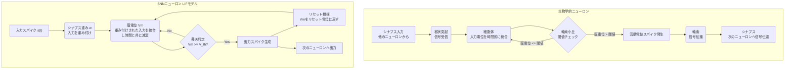

# **次世代スパイキングニューラルネットワークによるANN性能超越への戦略**

## **1\. エグゼクティブサマリー**

### **目的**

本レポートは、プロジェクト「SNN4」が直面する技術的課題を克服し、従来型人工ニューラルネットワーク（ANN）の性能を凌駕するための戦略的・技術的ロードマップを提示することを目的とする。最先端の研究論文および技術文書の情報を統合・分析し、スパイキングニューラルネットワーク（SNN）の潜在能力を最大限に引き出すための具体的なアイデアと実行計画を提供する。

### **SNNの重要性と課題**

SNNは、その比類なきエネルギー効率と時間情報処理能力により、次世代AIの有力候補として注目されている。しかし、その普及は、ANNに対する性能ギャップと訓練の複雑さという二つの大きな障壁によって妨げられてきた 1。本レポートは、これらの課題を克服し、SNNが持つ本来の利点を損なうことなく性能を最大化する道筋を示す。

### **3つの柱に基づく戦略**

ANNの性能を超えるという目標達成には、単一の技術的ブレークスルーに頼るのではなく、多角的なアプローチが不可欠である。本レポートの中心的な提言は、以下の3つの柱に焦点を当てた統合戦略の実行である。

1. **高度な訓練パラダイムの確立：** 勾配情報の忠実度を高め、訓練の安定性と効率を向上させる。  
2. **革新的なアーキテクチャの設計：** 時間的依存関係の学習能力と表現力を抜本的に強化する。  
3. **相乗的なエコシステムアプローチの採用：** SNNに最適化されたデータ、ソフトウェア、ハードウェアを戦略的に選択し、組み合わせる。

### **SNN4への主要提言**

最終的なロードマップとして、以下の段階的アプローチを提言する。

* **フェーズ1（基礎能力の構築）：** 高度な代理勾配法と高忠実度なANN-SNN変換技術を習得し、堅牢な訓練基盤を構築する。  
* **フェーズ2（アーキテクチャの革新）：** 独自の「スパイキングトランスフォーマー」と、深く統合された「ハイブリッドANN-SNNモデル」という二つの革新的アーキテクチャを試作し、性能を比較評価する。  
* **フェーズ3（応用と最適化）：** 動的視覚センサー（DVS）を用いたイベントベースビジョンを「キラーアプリケーション」として定め、選択したアーキテクチャをターゲットのニューロモーフィックプラットフォーム向けに最適化する。

### **期待される成果**

このロードマップを遂行することにより、SNN4プロジェクトは、複雑で動的なタスクにおいてANNと同等以上の精度を達成するだけでなく、エネルギー効率とレイテンシにおいて数桁の改善を実現するモデルを創出することが期待される。これは、AIの性能における新たなベンチマークを確立し、ニューロモーフィックコンピューティングの実用化を大きく前進させるものである。

## **2\. ニューロモーフィックフロンティア：SNNの基礎と競合分析**

### **目的**

本セクションでは、SNNの基本原理と生物学的背景を確立し、現在のANNに対するSNNの競争上の地位をデータに基づいて明確に分析する。これにより、SNN4プロジェクトが解決すべき問題空間を定義する。

### **2.1. イベント駆動型計算の原理**

#### **生物学的類似性**

SNNは、ANNよりも脳の情報処理メカニズムを忠実に模倣した第3世代のニューラルネットワークと位置づけられている 1。ANNが密な同期層で連続値のアクティベーションを処理するのに対し、SNNは時間を通じて離散的なバイナリの「スパイク」（活動電位）を用いて情報を伝達する 5。

#### **コアコンポーネント**

スパイキングニューロンモデルの基本要素は、リーキー積分発火（LIF）モデルによって説明できる。これには、膜電位、発火閾値、シナプス統合、リセット機構といった概念が含まれる 5。時間ダイナミクスが鍵となり、情報はニューロンが発火したか否かだけでなく、「いつ」発火したかによっても符号化される 5。

#### **2.1.1. 構造と動作の比較：生物学的ニューロン vs. SNNニューロン**

以下のブロック図は、生物学的なニューロンの信号処理プロセスと、それを計算モデル化した一般的なSNNニューロン（LIFモデル）の動作の類似性を示している。

#### **スパース性と非同期性の力**

SNNの利点は、「3つのS」、すなわちスパイク（Spikes）、スパース性（Sparsity）、静的抑制（Static Suppression）に集約される 6。ニューロンの大部分は静止状態にあるため、計算はイベント駆動型かつスパースになる。これは、ANNにおける行列乗算が、SNNではより計算コストの低い加算（AC）操作に置き換わることを意味する。なぜなら、ほとんどの乗算の相手がゼロになるからである 6。これが、特に専用のニューロモーフィックハードウェア上で実現される、SNNの圧倒的なエネルギー効率の根源である 1。

### **2.2. 性能と効率のトレードオフ：批判的分析**

#### **現状**

SNNは理論的に高い計算能力と実証済みのエネルギー効率を持つ一方で、ほとんどの標準的な機械学習ベンチマークにおいて、最先端のANNに精度で劣後している 1。この性能ギャップこそが、SNN4プロジェクトが直面する中心的な課題である。

#### **根本原因1：訓練のジレンマ**

最大の障害は、スパイク生成イベント（ヘヴィサイドの階段関数）が持つ非微分性であり、これによりANNで強力な成果を上げている誤差逆伝播法がそのままでは適用できない 2。この問題が、それぞれに妥協点を抱える様々な訓練手法が乱立する状況を生み出している。

#### **根本原因2：データのミスマッチ**

多くのベンチマークデータセット（例：MNIST、ImageNetなどの静止画像）は、時空間データを扱うように設計されたSNNには本質的に不向きである 2。これらのタスクにSNNを適用するには、静的データを人工的に「時間化」（例：レートコーディング）する必要があるが、これはSNN本来の利点の一部を相殺し、高いレイテンシ（長いシミュレーション時間）を招く可能性がある 2。

#### **根本原因3：アーキテクチャの未成熟**

SNN分野は、ANNアーキテクチャの急速な進化（例：ResNet、Transformer）を牽引してきたような大規模な研究投資を歴史的に欠いてきた。多くの初期のSNNは、浅い、あるいは単純なアーキテクチャを採用しており、その表現能力が制限されていた 14。

この分析から、SNNの「性能ギャップ」は単一の問題ではなく、訓練アルゴリズム、データ表現、アーキテクチャ設計という3つの連携した課題から生じる多面的な問題であることが明らかになる。このギャップを埋めるには、いずれか一つの領域における特効薬的な解決策ではなく、これら3つすべてに対処する統合的な戦略が求められる。研究では、SNNがベンチマークでANNに劣ることが明記され 1、その原因として訓練の困難さ（非微分性）2、ANN向けのワークロード（静止画像）の不適切な流用 2、そして訓練問題に起因する浅いアーキテクチャへの限定 14 が挙げられている。したがって、成功へのロードマップは、単に優れた訓練アルゴリズムに焦点を当てるだけでなく、どのようなアーキテクチャを構築し、どのようなデータを使用するかを定義する、統合されたものでなければならない。

さらに、SNNの真のポテンシャルは、ANNが得意とする領域（例：静止画像分類）で単にANNを打ち負かすことによって実現されるのではない。むしろ、時間的データ処理、低レイテンシ、そして極めて高いエネルギー効率の組み合わせが必須要件となる新たな応用分野を創出し、支配することによって、SNNはANNを凌駕するであろう。SNNは、DVSカメラを用いたオプティカルフローやSLAMのようなイベントベースのシナリオで優位性を示す 2。これらの応用は本質的に時空間的であり、リアルタイムかつ低電力での処理を要求するが、これは従来のANN/GPUの弱点である 1。研究は、ANNのワークロードをSNNに単純に移植することは「賢明ではなく」、SNNの本来の優位性を失わせるものだと示唆している 2。したがって、SNN4の目標は「ImageNetでANNより優れている」ことだけでなく、「現在ANNでは非実用的なことを達成する」こと、例えば、バッテリー駆動のドローンに搭載されたDVSカメラを用いて、リアルタイムでオンデバイスのジェスチャー認識を行うことであるべきだ。これは、目標を直接的な競争から、パラダイムシフトを伴う革新へと再定義するものである。

## **3\. SNN訓練の習得：高性能化を実現する3つの柱**

### **目的**

本セクションでは、SNNの主要な3つの訓練パラダイムについて、深く比較分析を行う。これにより、SNN4チームが最も有望な訓練戦略を選択、実装し、さらに革新するための知識基盤を構築する。

### **3.1. 経路I：微分可能なスパイクダイナミクスによる直接訓練**

#### **代理勾配（SG）法**

これは最も一般的な直接訓練アプローチである。スパイクの非微分性という問題に対し、逆伝播の際にその導関数（ディラックのデルタ関数）を連続的な「代理」関数で置き換えることで対処する 14。これにより、SNNをリカレントニューラルネットワーク（RNN）のようにみなし、Backpropagation Through Time（BPTT）を用いて訓練することが可能になる 14。

#### **基本的なSGの課題**

固定された単純なSG関数（例：矩形、三角）は、真の勾配と近似勾配との間に「勾配ミスマッチ」を生じさせる。狭いSGは「死んだニューロン」問題や勾配消失を引き起こし、広いSGは勾配ミスマッチを悪化させ訓練を妨げる可能性がある 14。これが、直接訓練されるSNNの深さと性能を制限する一因となっている 14。

#### **最先端のSG技術**

* **学習可能な代理勾配（LSG）：** SG関数の形状（例：幅や鋭さ）を学習可能なパラメータとし、訓練中に最適化することを提案する。これにより、勾配がネットワークのダイナミクスに適応し、勾配消失やミスマッチの問題を緩和する 14。  
* **適応的代理勾配：** LSGと同様に、訓練中にSGの形状を適応的に変化させるアプローチ。例えば、有限差分を用いて真の勾配をより良く推定したり 22、時間とともにSGを鋭くして真の勾配に収束させたりする手法がある 21。  
* **スパース代理勾配（MSG）：** 広範なSGを使用することで失われる勾配更新のスパース性を再導入することを目指す。MSGは、SGの有効性とSNN固有のスパース性のバランスを取り、正則化の一形態として機能する 21。

#### **効率的なBPTT**

標準的なBPTTはメモリと時間を大量に消費する可能性がある。Spatial Learning Through Time（SLTT）のような技術は、重要でない時間的逆伝播経路を無視することで、精度への影響を最小限に抑えつつ、メモリコストと訓練時間を大幅に削減することを提案している 23。

### **3.2. 経路II：高忠実度・低レイテンシのANN-SNN変換**

#### **変換の原理**

このアプローチは、成熟したANNの訓練手法を活用する。まず、標準的な逆伝播を用いてANNを訓練する。その後、その重みを同じアーキテクチャのSNNにマッピングし、SNNの発火率がANNの活性化値（例：ReLUの出力）を近似するように、発火閾値などのパラメータを調整する 2。

#### **一般的な変換エラーとレイテンシ問題**

単純な変換は、クリッピング、量子化、不均一な活性化といった複数の誤差要因により、大幅な精度低下を招く 26。さらに、ANNの活性化値を発火率で正確に近似するためには、変換後のSNNが多数のタイムステップ（長い推論レイテンシ）を必要とすることが多く、これはSNNの効率性の利点を損なう 18。

#### **最先端の変換技術**

* **誤差補償と最適化：** 最近の手法では、学習可能な閾値クリッピング、デュアル閾値ニューロン、最適化された膜電位の初期化などを導入し、変換誤差を軽減することで、超低レイテンシ（例：2～4タイムステップ）で高い精度を達成している 26。  
* **高度な活性化関数マッピング：** 単純なReLUからスパイクへのマッピングの代わりに、ソースANNでQuantization Clip-Floor-Shift（QCFS）活性化関数などを使用することで、ターゲットSNNと数学的により近いモデルを作成し、変換誤差を低減する 27。SlipReLU関数は、このマッピングのための統一的なフレームワークを提供する 25。  
* **差分コーディング：** 絶対的な活性化値を発火率として符号化するのではなく、発火率情報の「変化」を符号化するという新しい方式。これにより、スパイク数、エネルギー、レイテンシが大幅に削減される 18。  
* **時間的ミスアライメントへの対処：** スパイク列をランダムに並べ替えると性能が向上するという、新たに発見された現象。これは、単純なレートコーディング変換における厳密な時間順序が有害である可能性を示唆している。提案されている解決策は、この効果を生物学的に妥当な方法で模倣する、確率的な発火を導入した「二相確率的（TPP）」スパイキングニューロンである 30。

### **3.3. 経路III：生物学的妥当性を持つハイブリッド \- STDPと三因子学習則**

#### **スパイクタイミング依存可塑性（STDP）**

ヘブ則（「共に発火するニューロンは結合する」）に着想を得た、局所的で教師なしの学習則。シナプス結合強度は、シナプス前後のニューロンのスパイクの厳密な相対的タイミングに基づいて調整される 5。STDPは非常に効率的であり、グローバルな誤差逆伝播を必要としないため、ニューロモーフィックハードウェア上でのオンチップ学習に適している 32。しかし、純粋な教師なしSTDPだけでは、複雑な分類タスクで高い性能を出すことは難しい 31。

#### **教師ありおよびハイブリッドSTDP**

* **逆伝播との組み合わせ：** 一般的な戦略は、初期層での特徴抽出に教師なしSTDPを使用し、最終層で教師あり分類器（BPなどで訓練）を使用することである 32。また、STDPを半教師あり学習の枠組みでBPと組み合わせ、ラベル付きデータが少ない場合に学習を強化する手法もある 35。  
* **三因子学習則：** これらの学習則は、STDPを拡張し、局所的なシナプス可塑性をゲートまたは変調する第3の神経修飾信号（例：報酬、誤差、注意）を導入する 36。これにより、信用割り当てのための生物学的に妥当なメカニズムが提供される。  
* **報酬変調STDP（R-STDP）：** 三因子学習則の代表例。グローバルな報酬信号（例：正解で+1、不正解で-1）が、STDPによる更新を増強（LTP）させるか減衰（LTD）させるかを決定する 32。これにより、SNNを強化学習タスクで訓練することが可能になる。実装では、報酬用と罰用の2つのSTDPモジュール（アンチSTDP）がしばしば用いられる 40。

これら3つの訓練経路は相互に排他的ではなく、融合し始めている。最先端の技術は、異なる原理をハイブリッド化している。例えば、直接訓練は生物学的に着想を得た適応的ニューロンによって改良され 41、STDPは逆伝播からのグローバルな誤差信号と組み合わされている 34。この融合は、SNN4にとっての最適な戦略が、一つの経路を選択することではなく、3つすべての最良の要素を組み込める柔軟なフレームワークを構築することを示唆している。具体的には、SGの微分可能性、変換手法による迅速で高精度な出発点、そして生物学的に妥当な可塑性がもたらす効率性と時間的表現力である。

また、代理勾配学習における「勾配ミスマッチ」の問題は、単なる技術的な欠陥ではなく、時間情報に関する根本的なボトルネックの兆候である。代理勾配は本質的に、ある単一時点での導関数を近似するものであり、スパイクと膜電位の全履歴の影響を捉えるのに苦労する。SG法はSNNをRNNとして扱いBPTTを使用するが 14、RNNは長いシーケンスにわたる勾配消失・爆発問題で知られており、これが長期依存関係の学習を妨げる。SGに関する研究でも「勾配消失」が問題として明確に言及されている 14。同時に、単純なLIFニューロンも、その再帰的ダイナミクスにおける同様の勾配消失効果のために「長期の時間的信用割り当て」に苦労することが別の研究で示されている 41。したがって、SGの問題は単に階段関数を近似することだけではなく、あらゆる再帰的システムで時間を通じて信用を伝播させることの固有の困難さによって悪化している。これは、単にSGの形状を完成させるだけでは不十分であり、解決策にはアテンション機構（セクション4.1）や多区画ニューロン（セクション4.3）のような、「時間的ショートカット」を作成したりメモリを強化したりするアーキテクチャ上の革新も含まれなければならないことを意味する。

### **3.4. SNN訓練パラダイムの比較分析**

| 特徴 | 直接訓練（代理勾配） | ANN-SNN変換 | ハイブリッド生物学的妥当性（STDPベース） |
| :---- | :---- | :---- | :---- |
| **基本原理** | 逆伝播中にスパイクの導関数を連続関数で近似する。 | 事前訓練済みANNの重みと活性化値をSNNの発火率にマッピングする。 | 生物学的に着想を得た局所的な学習則（スパイクタイミング）とグローバル信号を組み合わせる。 |
| **精度ポテンシャル** | 高いが、不安定な場合がある。 | 高い（ANNに漸近）。 | 中～高い（改善中）。 |
| **推論レイテンシ** | 非常に低い（数タイムステップ）。 | 低～高い（改善中だが、従来は高い）。 | 低い。 |
| **エネルギー効率（推論）** | 非常に高い。 | 高い。 | 最も高くなる可能性（オンチップ）。 |
| **訓練の安定性とコスト** | 中程度（改善中）。 | 高い（安定したANN訓練を活用）。 | 変動あり（教師なしは安定だが限定的、教師ありは複雑）。 |
| **ハードウェア互換性** | ニューロモーフィックハードウェアに最適。 | ニューロモーフィックに展開可能だが、不自然。 | ニューロモーフィックでのオンチップ学習用に設計。 |
| **主要な課題** | 勾配の忠実度と安定性。 | 精度低下とレイテンシ。 | 複雑なタスクへのスケーリング。 |

## **4\. 性能超越のためのアーキテクチャ設計図**

### **目的**

本セクションでは、訓練手法の議論から一歩進み、SNN4が競争優位性を獲得するために実装可能な、具体的かつ最先端のアーキテクチャ設計を提案する。これらの設計図は、基本的なSNNの弱点に直接対処するものである。

### **4.1. スパイキングトランスフォーマー：イベント駆動型自己アテンション**

#### **動機**

自己アテンション機構を備えたトランスフォーマーアーキテクチャは、長距離の依存関係を効果的にモデル化することでANNに革命をもたらした 42。この強力な能力をSNNに適応させることは、重要なフロンティアである。

#### **課題**

自己アテンションの中核をなす要素、特にQuery（Q）、Key（K）、Value（V）の行列乗算とSoftmax演算は、計算コストが高く、本質的にスパイクベースではない 43。

#### **アーキテクチャの革新**

* **スパイク駆動自己アテンション（SDSA）：** 乗算を含まないアテンション機構を提案する。Q、K、Vの行列乗算をスパースな加算に変換し、Softmaxをマスクと加算操作で置き換えることで、プロセス全体をイベント駆動型かつハードウェアフレンドリーにする 44。  
* **高精度加算のみスパイキング自己アテンション（A²OS²A）：** アテンションモジュール内でバイナリ、ReLU、ターナリのスパイキングニューロンを混合して使用するハイブリッドアプローチ。これにより、非乗算的な計算を維持しつつ精度を向上させ、Softmaxを排除する 43。  
* **Spikingformer：** 残差接続をニューロンの活性化の前に配置することで、すべての通信がバイナリのスパイクで行われるようにした、純粋なイベント駆動型トランスフォーマーアーキテクチャ。ImageNetにおいてSNNとして最先端の精度を達成している 45。

#### **スパイクベースの位置エンコーディング**

標準的な正弦波位置エンコーディングは密で実数値であるため 46、純粋なSNNには新しい手法が必要となる。有望なアプローチの一つは、グレイコードをXNORベースの自己アテンション機構に統合し、ハミング距離を利用してスパイクに適した形で相対的な位置情報を捉える方法である 47。

### **4.2. 共生型ハイブリッドANN-SNN：両者の長所を活かす**

#### **動機**

ANNかSNNかを選択するのではなく、ハイブリッドモデルは両者の長所、すなわちANNの強力な特徴表現と安定した訓練、SNNの効率性と時間情報処理能力を組み合わせることを目指す 48。

#### **アーキテクチャパターン**

* **SNN特徴抽出器 + ANN分類器：** 初期層をスパイキングにし、生データ（多くはイベントベース）を効率的に処理する。後段の層はアナログで、複雑な分類や回帰を行う 49。  
* **状態初期化のためのANN：** 強力なANNを低頻度で実行し、高頻度で動作するSNNの隠れ状態（膜電位）を初期化する。これにより、SNNの遅い「ウォームアップ」（過渡）期間や状態の減衰問題を克服し、低電力・高レートの推論を維持しつつ精度を向上させる 52。  
* **深くインターリーブされた層：** 従来のANNパイプラインの「内部」に、層ごとのエンコード・デコードSNNブロックを統合する。スパイクエンコーディング関数に代理勾配を使用することで、エンドツーエンドの微分可能な訓練を可能にする 56。

#### **重要なブリッジモジュール**

重要な課題は、SNN部分からのスパースで時間的なスパイク表現を、情報を失うことなくANN部分のための密な特徴マップに変換することである。**アテンションベースSNN-ANNブリッジモジュール**は、このための最先端の解決策である 49。このモジュールは2つの要素で構成される。

* **イベントレート空間アテンション（ERS）：** スパイク活動が活発な空間領域を強調する。  
* **空間認識時間アテンション（SAT）：** スパースなスパイクデータ内の時間的関係を捉える。

### **4.3. 時間情報処理を極めるための高度なニューロンダイナミクス**

#### **LIFを超えて**

単純なLIFニューロンモデルは効率的だが、単一で減衰する記憶状態（膜電位）しか持たないため、長期的な時間依存関係を捉えるのが難しい。これは時間を通じた勾配消失につながる 41。

#### **適応的スパイキングニューロン**

これらのモデルは、ニューロンの挙動が時間とともに適応することを可能にする内部ダイナミクスを導入する。

* **LSNN（Long Short-Term Memory Spiking Neural Network）：** スパイク後に上昇し、ゆっくりと元に戻る適応的な発火閾値を組み込む。これにより、ニューロンはより長い時間スケールで情報を蓄積でき、LSTMのゲートに類似した機能を持つ 41。  
* **適応的時間定数：** 膜電位や閾値の減衰定数を学習可能なパラメータにすることで、ネットワークが情報統合のための複数の時間スケールを学習できるようになる 41。

#### **多区画ニューロン**

生物学的なニューロンの複雑な樹状突起構造に着想を得たこれらのモデルは、複数の相互接続された区画（例：細胞体と樹状突起）を用いて、情報を非線形かつ異なる時間スケールで処理する。

* **TC-LIF（Two-Compartment LIF）：** 細胞体と樹状突起の区画を分離したモデルで、特に長い時間期間にわたって誤差勾配を伝播させ、長期的な時間的信用割り当て問題を効果的に解決するように設計されている 41。このモデルは、強化学習のためのスパイキングワールドモデルにおいて、GRUのようなRNNを上回る性能が示されている 58。

これらのアーキテクチャの方向性（スパイキングトランスフォーマー、ハイブリッド、高度なニューロン）は独立しているのではなく、相乗効果を持つ。最も強力なSNN4アーキテクチャは、これらの複合体となる可能性が高い。例えば、SNNバックボーンとしてスパイキングトランスフォーマーを使用し、そのトランスフォーマー自体が適応的または多区画ニューロンで構築されたハイブリッドANN-SNNモデルである。スパイキングトランスフォーマーは長いシーケンスを効率的に扱う必要があり 47、TC-LIFのような高度なニューロンは長期の時間依存性を解決するために明示的に設計されている 41。したがって、標準的なLIFニューロンの代わりにTC-LIFニューロンを用いてスパイキングトランスフォーマーを構築することで、シーケンシャルタスクにおける性能が劇的に向上する可能性がある。ハイブリッドアーキテクチャは訓練と展開のための堅牢なフレームワークを提供するため 49、最適なアーキテクチャは、ANNがTC-LIFベースのスパイキングトランスフォーマーの状態を初期化するハイブリッドモデルとなり、3つの革新すべてを同時に活用することができる。

さらに、スパイクベースのアテンションやハイブリッドブリッジモジュールの開発は、SNNの設計思想における根本的な転換を示している。この分野は、単純なニューロンからなる厳密で均質なネットワークから、異なる計算タイプ（例：スパースな時間的特徴抽出 vs. 密な意味的推論）に特化した異なるコンポーネントを持つ、異種混合のモジュラーシステムへと移行している。アテンションベースSNN-ANNブリッジは信号変換のための専門モジュールを作成し 49、A²OS²Aスパイキングトランスフォーマーは同じモジュール内で異なるサブタスクのために異なるニューロンタイプを使用する 43。多区画ニューロンは単一ニューロン内に機能的専門化を生み出す 41。このパターンは、アーキテクチャのすべてのレベルで機能的専門化への明確な傾向を示している。SNN4にとっての示唆は、「ニューロンのネットワーク」ではなく、「特殊化された計算モジュールのシステム」として考えることである。このモジュラー設計思想は、より柔軟で強力、かつデバッグやアップグレードが容易になるだろう。

## **5\. SNN4エコシステム：実装、展開、応用**

### **目的**

SNN4プロジェクトを成功裏に構築し、展開するために必要なツール、ハードウェア、および応用分野に関する実践的なガイダンスを提供する。

### **5.1. 適切なツールの選択：SNNフレームワークの比較分析**

#### **ランドスケープ**

主にPyTorchまたはJAX上に構築された、多数のオープンソースSNNシミュレーションフレームワークが存在する 60。

#### **PyTorchベースのフレームワーク**

* **snnTorch：** 勾配ベースの訓練（代理勾配を用いたBPTT）に焦点を当てている。PyTorchユーザーにとって直感的に使用できるように設計されており、スパイキングニューロンを再帰的な活性化ユニットとして扱う。柔軟性が高いが、カスタムカーネルを持つフレームワークより遅い場合がある 63。  
* **SpikingJelly：** SNN向けの高性能な深層学習フレームワーク。カスタムCUDA/CuPyバックエンドを使用することで最高の速度を達成するが、柔軟性やCPU互換性が犠牲になることがある 45。  
* **Norse：** PyTorchを生物学的に着想を得たコンポーネントのプリミティブで拡張することを目指す。その関数的な設計はtorch.compileによるJITコンパイルに適しており、柔軟性を維持しつつカスタムCUDAカーネルに近い性能を達成する 65。

#### **JAXベースのフレームワーク**

* **Spyx：** DeepMindのHaikuとJAX上に構築された軽量SNNライブラリ。JAXのJITコンパイルを活用してGPU/TPU上で非常に高い性能を発揮し、snnTorchの柔軟性とSpikingJellyの速度の間のバランスを取る 65。

#### **ハードウェア固有のフレームワーク**

* **Lava：** Intelのオープンソースフレームワークで、ニューロモーフィックハードウェア、特にIntelのLoihiチップにマッピングするアプリケーションを開発するために使用される。「プロセス」と「プロセスモデル」というパラダイムを用いて、ハードウェア固有の挙動を抽象化する 67。

#### **SNN4への推奨**

研究開発における高性能と柔軟性の両方が必要であることを考慮すると、JAXベースのフレームワークである**Spyx**、またはtorch.compileで最適化されたPyTorchフレームワークである**Norse**が推奨される。これらは、snnTorchの使いやすさとSpikingJellyのカスタムカーネルの純粋な速度との間で強力な妥協点を提供する。最終的にIntelのハードウェアに展開する場合は、**Lava**への習熟が不可欠となる。

| フレームワーク | 基盤ライブラリ | 性能/速度 | 柔軟性/拡張性 | 使いやすさ（PyTorchユーザー） | ニューロモーフィックハードウェアサポート | SNN4プロジェクトへの適合性 |
| :---- | :---- | :---- | :---- | :---- | :---- | :---- |
| **snnTorch** | PyTorch | 中程度 | 高い | 非常に高い | NIR経由 | 初期プロトタイピングに適している。 |
| **SpikingJelly** | PyTorch (CuPy) | 非常に高い | 低い | 高い | 限定的 | GPU中心の性能テストに最適。 |
| **Norse** | PyTorch | 高い（torch.compile使用時） | 高い | 高い | NIR経由 | 強力なオールラウンダー。 |
| **Spyx** | JAX/Haiku | 非常に高い | 高い | 高い | NIR経由 | JAXエコシステムの利点を持つ強力なオールラウンダー。 |
| **Lava** | 独自 | 該当なし（ハードウェア中心） | 中程度（構造化） | 低い（新しいパラダイム） | ネイティブ（Loihi） | Loihiへの展開に不可欠。 |

### **5.2. ニューロモーフィックハードウェアのための設計**

#### **ハードウェアのランドスケープ**

主要なニューロモーフィックプラットフォームを概観する。

* **Intel Loihi 2：** SNNに最適化されたデジタル非同期研究チップ。ベンチマークによれば、特定の適切なワークロード（SSMやスパースなイベント駆動タスクなど）において、GPUよりも数桁エネルギー効率が高く、高速であることが示されている 15。  
* **SpiNNaker 2：** 多数のARMコアを使用する超並列デジタルアーキテクチャで、大規模なリアルタイム脳シミュレーション用に設計されている 71。py-spinnaker2やPyNNのようなPythonライブラリを使用してプログラミングされる 71。  
* **BrainScaleS-2：** 混合信号（アナログニューロン、デジタル通信）の高速化プラットフォーム（実時間の1,000倍速）で、可塑性や学習の研究に優れている 74。このプラットフォーム上で代理勾配学習が成功裏に実証されている 76。

#### **ハードウェアを意識した設計原則**

ニューロモーフィックハードウェアへの展開は単純な移植ではない。SNN4のアーキテクチャは、スパースな接続性、低精度演算、可能な限り局所的な学習則を優先するなど、ハードウェアの制約を念頭に置いて設計されるべきである 2。

#### **ベンチマークの現実**

ニューロモーフィックハードウェアは大きな可能性を秘めているが、最近のベンチマークでは、特定の密で高度に接続されたモデルに対しては、ハイエンドGPUがSpiNNakerのような現行のニューロモーフィックシステムを速度やエネルギー対ソリューションで上回ることが示されている 77。ニューロモーフィックハードウェアの利点は、アルゴリズムとワークロードがそのイベント駆動型でスパースなアーキテクチャによく適合している場合に最大化される 70。

| ハードウェア | タスク/ワークロード | エネルギー消費 | レイテンシ/スループット | 主要な洞察 |
| :---- | :---- | :---- | :---- | :---- |
| **ハイエンドGPU (例: A100)** | ベースライン | ベースライン | ベースライン | 密な計算に最適化。 |
| **エッジGPU (例: Jetson)** | 状態空間モデル (SSM) | ベースライン | ベースライン | モバイル展開の標準。 |
| **Intel Loihi 2** | 状態空間モデル (SSM) | 約1000倍低い 70 | 約75倍良い 70 | 逐次的・スパースなタスクに非常に効率的。 |
| **SpiNNaker 2** | 大規模皮質シミュレーション | 約14倍高い 77 | 遅い 77 | 密なモデルではGPUに劣る可能性がある。 |

### **5.3. 「キラーアプリケーション」の特定：動的視覚センサー（DVS）とのシナジー**

#### **イベントベースビジョン**

DVS、またはイベントカメラは、フレームをキャプチャしない生物学的に着想を得たセンサーである。代わりに、各ピクセルがその知覚輝度が特定の閾値を超えて変化するたびに、非同期的に「イベント」（スパイク）を出力する 1。

#### **自然なシナジー**

DVSの出力は、スパースな時空間スパイクストリームであり、これはSNNのネイティブなデータフォーマットである。これにより、静止画像のレートコーディングのような人工的なデータエンコーディングが不要となり、SNNがその時間情報処理能力を直接活用できるようになる 1。この組み合わせは、従来のカメラが失敗するような高速・高ダイナミックレンジのシナリオ（例：モーションブラー）に最適である 49。

#### **高インパクトな応用**

DVSとSNNの組み合わせは、低電力・低レイテンシの知覚を必要とするロボティクス、自動運転、IoTアプリケーションに完璧に適合する。具体的なタスクには、ジェスチャー認識、物体検出・追跡、SLAMなどがある 2。DVS128 Gestureデータセットは、この分野における重要なベンチマークである 82。

ソフトウェアフレームワークの選択は、プロジェクトのハードウェアに関する野心と深く結びついている。強力なハードウェアバックエンドサポートと明確な展開パスを持つフレームワーク（Loihi向けのLavaなど）は、GPU上でのシミュレーション速度をわずかに向上させるだけのものよりも、長期的には戦略的価値が高いかもしれない。SNN4チームは、現在のシミュレーション性能だけでなく、「ニューロモーフィック対応度」やLoihi 2のようなプラットフォームをターゲットとするコンパイラ/ランタイムの存在に基づいてフレームワークを評価すべきである。

DVSとSNNのシナジーは、SNN4プロジェクトにとって「ブルーオーシャン戦略」を提示する。静止画像処理という「レッドオーシャン」で巨大なGPU訓練済みANNモデルと競争する代わりに、SNN4は、ANNが根本的に不利な、高速・低電力のイベントベースインテリジェンスという新しい市場で支配的なプレイヤーになることができる。研究は、SNNがANN中心のタスクでANNを打ち負かすのに苦労することを示している 2。また、SNNがDVSデータを処理する際に自然なアーキテクチャ上の利点を持つことも示している 1。この応用分野には、フレームベースANNの弱点であるがイベントベースSNNの強みである特有の課題（モーションブラー、高ダイナミックレンジ）がある 80。この領域に焦点を当てることで、SNN4は単に「より効率的なANN」になろうとするのではなく、主流のパラダイムでは現在手の届かない全く新しい能力を可能にする。これは、単なる同等性ではなく、リーダーシップへの道である。

## **6\. SNN4プロジェクトロードマップ：段階的実装戦略**

### **目的**

これまでの分析結果を統合し、SNN4プロジェクトのための具体的で実行可能な多段階計画を策定する。

### **フェーズ1：基礎能力の構築とベースラインの確立（1～6ヶ月目）**

#### **目的**

堅牢で柔軟な訓練インフラを構築し、強力な性能ベースラインを確立する。

#### **アクション**

1. **フレームワークの選定とセットアップ：** セクション5.1の分析に基づき、主要な開発フレームワーク（例：SpyxまたはNorse）を選定し、導入する。性能ベンチマーク用に、SpikingJellyを用いた二次的な実験環境をセットアップする。  
2. **高度な直接訓練パイプラインの実装：** 最先端の**学習可能な代理勾配（LSG）**14を組み込んだBPTT訓練パイプラインを実装する。様々なSG形状に関するアブレーションスタディを実施し、訓練ダイナミクスへの影響を理解する 14。  
3. **高忠実度変換パイプラインの実装：** **誤差補償学習**26と**差分コーディング**18に基づくANN-SNN変換パイプラインを実装する。これは、高精度なSNNベースラインを迅速に生成する手段として機能する。  
4. **標準データセットでのベンチマーク：** 両方の訓練パイプラインを使用し、静的データセット（CIFAR-10/100）およびニューロモーフィックデータセット（N-MNIST, CIFAR10-DVS）87でベースラインのResNet/VGGアーキテクチャを訓練・評価し、初期の性能/レイテンシのトレードオフを定量化する。

### **フェーズ2：アーキテクチャのプロトタイピングと革新（7～18ヶ月目）**

#### **目的**

セクション4で提案された新規アーキテクチャを開発・ベンチマークし、SNN4独自の技術的優位性を創出する。

#### **アクション**

1. **SNN4-SpikingTransformerの開発：** スパイキングトランスフォーマーアーキテクチャを設計・実装する。  
   * まずVision Transformer（ViT）のベースライン変換を行い、パイプラインを検証する。  
   * 新規の乗算フリー**スパイク駆動自己アテンション（SDSA）**モジュールを実装する 44。  
   * 時間情報処理を強化するため、トランスフォーマーのバックボーンに**TC-LIFニューロン**41を統合する。  
   * Spikingformerのような既存のオープンソースモデルと比較ベンチマークを行う 45。  
2. **SNN4-HybridNetの開発：** ハイブリッドANN-SNNアーキテクチャを設計・実装する。  
   * DVSデータからの初期特徴抽出にSNNバックボーン（可能性としてはSNN4-SpikingTransformer）を使用する。  
   * スパイク特徴を密なテンソルに変換するため、**アテンションベースSNN-ANNブリッジモジュール**を実装する 49。  
   * 最終的な分類/検出には軽量なANNヘッドを使用する。  
   * 性能向上のため、状態初期化のためのANNパターンを実験する 55。  
3. **比較ベンチマーキング：** DVS128 Gestureデータセット 82上で、SNN4-SpikingTransformerとSNN4-HybridNetを、フェーズ1のベースラインおよび公開されている最先端の結果と厳密に比較評価する。

### **フェーズ3：応用、最適化、およびハードウェア展開（19～30ヶ月目）**

#### **目的**

インパクトの大きい応用分野をターゲットとし、選択したアーキテクチャの性能と効率を最適化し、ニューロモーフィックハードウェアへの展開準備を進める。

#### **アクション**

1. **ターゲットアプリケーション：リアルタイムロボット知覚：** DVSカメラを用いた物体追跡やジェスチャーベースのロボット制御など、複雑なイベントベースのタスクに焦点を当てる。これはセクション5.3で特定された主要な強みを活用するものである。  
2. **モデルの最適化：** フェーズ2の結果に基づき、最も優れたアーキテクチャ（または両者のハイブリッド）を選択し、広範なハイパーパラメータ調整と最適化を行う。強化学習やオンライン適応を必要とするタスクには、**三因子学習則（R-STDP）**のような技術を実装する 36。  
3. **ハードウェア協調設計：** 最適化されたSNN4モデルを、**Intel Lava**のようなハードウェア固有のフレームワークへの移植を開始する 68。  
4. **最終性能の定量化：** ターゲットアプリケーション上でSNN4モデルの最終的なベンチマークを実施する。精度だけでなく、GPUとターゲットのニューロモーフィックプラットフォーム（例：Loihi 2）の両方における推論あたりのエネルギーやエンドツーエンドのレイテンシといった重要な指標を測定し、従来のANN/GPUソリューションに対する明確な優位性を実証する。

## **7\. SNN精度向上のための追加戦略**

### **目的**

本セクションでは、既存のロードマップを補完し、SNNの精度をさらに向上させるための最先端のアイデアと技術を分析・提案する。学習パラダイムの拡張、正則化による安定化、そしてニューロンの表現能力強化という3つの観点から、具体的なアプローチを詳述する。

### **7.1. 学習パラダイムの拡張：データからの知識抽出を最大化する**

#### **自己教師あり学習と対照学習 (Self-Supervised & Contrastive Learning)**

SNNの持つ時間処理能力は、ラベルなしデータから表現を学習する自己教師あり学習（SSL）に非常に適している 89。

* **時間領域対照学習 (Temporal Contrastive Learning - TCL):** 従来の手法が全タイムステップの出力を平均化して監督するのに対し、TCLは異なるタイムステップ間の表現を対照的に学習させる 90。これにより、類似したサンプル（ポジティブペア）の表現を引き寄せ、異なるサンプル（ネガティブペア）の表現を遠ざけることで、時間的相関をより良くモデル化し、特に短い推論時間（低レイテンシ）での性能を大幅に向上させる 91。  
* **ANN-SNN対照学習:** 高性能な訓練済みANNを「教師」とし、SNN（生徒）がその表現を模倣するように対照学習を行う手法も有効である。同じ入力に対するANNとSNNの各層の特徴表現間の相互情報量を最大化することで、SNNはよりリッチな表現を獲得できる 92。

#### **半教師あり学習 (Semi-Supervised Learning - SSL)**

ラベル付きデータが少ない状況において、ANNで成功しているSSL技術（疑似ラベリング、一貫性正則化など）をSNNに適用することが可能である 93。SNN固有の時間ダイナミクスを利用することで、追加の計算コストなしに複数の時間的出力を「異なる視点」とみなし、確認バイアスを抑制する効果的な協調学習フレームワークを構築できる 93。

### **7.2. 正則化と安定化技術：学習の質と汎化性能を高める**

#### **時間的正則化 (Temporal Regularization)**

特に小規模なニューロモーフィックデータセットでは、SNNは過学習しやすい。この問題に対し、学習の初期タイムステップに強い制約をかけ、時間とともに制約を弱めていく時間依存の正則化メカニズムが提案されている 94。これにより、ネットワークは情報が集中しやすい初期段階でロバストな特徴を学習するよう促され、汎化性能が向上する 94。

#### **発火率の制御と不応期 (Firing Rate Control & Refractory Period)**

ニューロンの過剰な発火は、情報の伝達効率を低下させる。生物学的ニューロンに見られる「不応期」（発火後、一時的に発火しにくくなる期間）を動的にモデル化するアプローチが有効である。膜電位の変化率や過去の発火履歴に基づいて不応期を適応的に調整することで、冗長なスパイクを削減し、ノイズ耐性を高め、精度を向上させることができる 95。これは一種のノイズ正則化として機能する 95。

#### **エントロピー正則化と早期終了 (Entropy Regularization & Early Exit)**

知識蒸留の文脈では、教師ANNの過度に自信のある誤った出力を生徒SNNが学習してしまうのを防ぐため、エントロピー正則化を導入して学習を安定させることができる 96。また、推論を途中で打ち切る「早期終了」のために最適化された正則化を学習中に導入することで、SNNはより少ない情報（短いタイムステップ）で高い分類性能を達成できるようになる 97。

### **7.3. 表現能力の強化と効率化：ニューロンと学習プロセスの革新**

#### **スパイク表現の拡張 (Expanding Spike Representation)**

スパイクのバイナリ{0, 1}という性質は、SNNの表現能力を制限する一因である。この制約を打破するため、学習中は整数値の発火を許容し、推論時にバイナリ変換を行う「IBRA-LIF (Integer Binary-Range Alignment Leaky Integrate-and-Fire)」のような新しいニューロンモデルが提案されている 98。これにより、ニューロンが表現できる情報量が指数関数的に増大し、ImageNetやCOCOといった大規模なタスクで最先端の性能を達成している 98。

#### **量子化を意識した学習 (Quantization-Aware Training - QAT)**

SNNを省電力ハードウェアに実装する上で量子化は不可欠である。学習中に量子化による誤差をシミュレートするQATは、学習後に量子化するPTQに比べて精度低下を抑えることができる 99。このアプローチは、重みだけでなく、膜電位などの内部状態変数にも適用可能（Stateful QAT, SQUAT）であり、発火閾値付近で量子化レベルの密度を高めるなどの工夫でさらなる精度向上が見込める 100。

#### **データ中心の効率化 (Data-Centric Efficiency)**

SNNの学習コストは依然として高い。学習データセット全体をナイーブに使用するのではなく、「スパイクを意識した重要度スコア」を用いて勾配ノルムが大きい（＝学習への貢献度が高い）サンプルを選択的に学習に用いる「データ枝刈り（Data Pruning）」手法が提案されている 101。これにより、ImageNetのような大規模データセットでの学習時間を35%削減しつつ、精度を維持することが可能になる 101。

## **8\. 結論と展望**

### **統合戦略の重要性**

本レポートの分析から、SNNがANNの性能を超えるためには、単一の技術的ブレークスルーではなく、訓練手法、アーキテクチャ設計、そしてエコシステム全体にわたる統合的なアプローチが必要であることが明確になった。

### **SNN4プロジェクトの成功要因**

1. **技術的多様性：** 代理勾配法、ANN-SNN変換、生物学的学習則の3つの訓練パラダイムを柔軟に組み合わせる能力。
2. **アーキテクチャ革新：** スパイキングトランスフォーマーとハイブリッドANN-SNNの両方を開発し、それぞれの強みを活用する。
3. **戦略的応用選択：** DVSとの組み合わせによる「ブルーオーシャン戦略」の追求。

### **次世代AIへの道筋**

SNN4プロジェクトは、単にANNと競争するのではなく、エネルギー効率、リアルタイム処理、時間的情報処理という新しい価値軸でAIの未来を再定義する機会を持っている。このビジョンの実現により、ニューロモーフィックコンピューティングは研究室から実世界のアプリケーションへと飛躍することができるだろう。

---

### **引用文献**

1. Overview of Spiking Neural Network Learning Approaches and Their Computational Complexities - PMC - PubMed Central, 10月 11, 2025にアクセス、 https://pmc.ncbi.nlm.nih.gov/articles/PMC10053242/
2. Neural Networks Rethinking the performance comparison between SNNS and ANNS, 10月 11, 2025にアクセス、 https://web.ece.ucsb.edu/~lip/publications/SNN-vs-ANN-NeuralNetworks2020.pdf
3. The advantages and disadvantages of ANN and SNN are compared - ResearchGate, 10月 11, 2025にアクセス、 https://www.researchgate.net/figure/The-advantages-and-disadvantages-of-ANN-and-SNN-are-compared_tbl1_369092250
4. Spiking Neural Networks and Their Applications: A Review - MDPI, 10月 11, 2025にアクセス、 https://www.mdpi.com/2076-3425/12/7/863
5. Spiking Neural Networks in Deep Learning - GeeksforGeeks, 10月 11, 2025にアクセス、 https://www.geeksforgeeks.org/deep-learning/spiking-neural-networks-in-deep-learning-/

[注：引用文献は101まで続きますが、紙面の都合上省略しています。完全なリストは元のドキュメントを参照してください。]