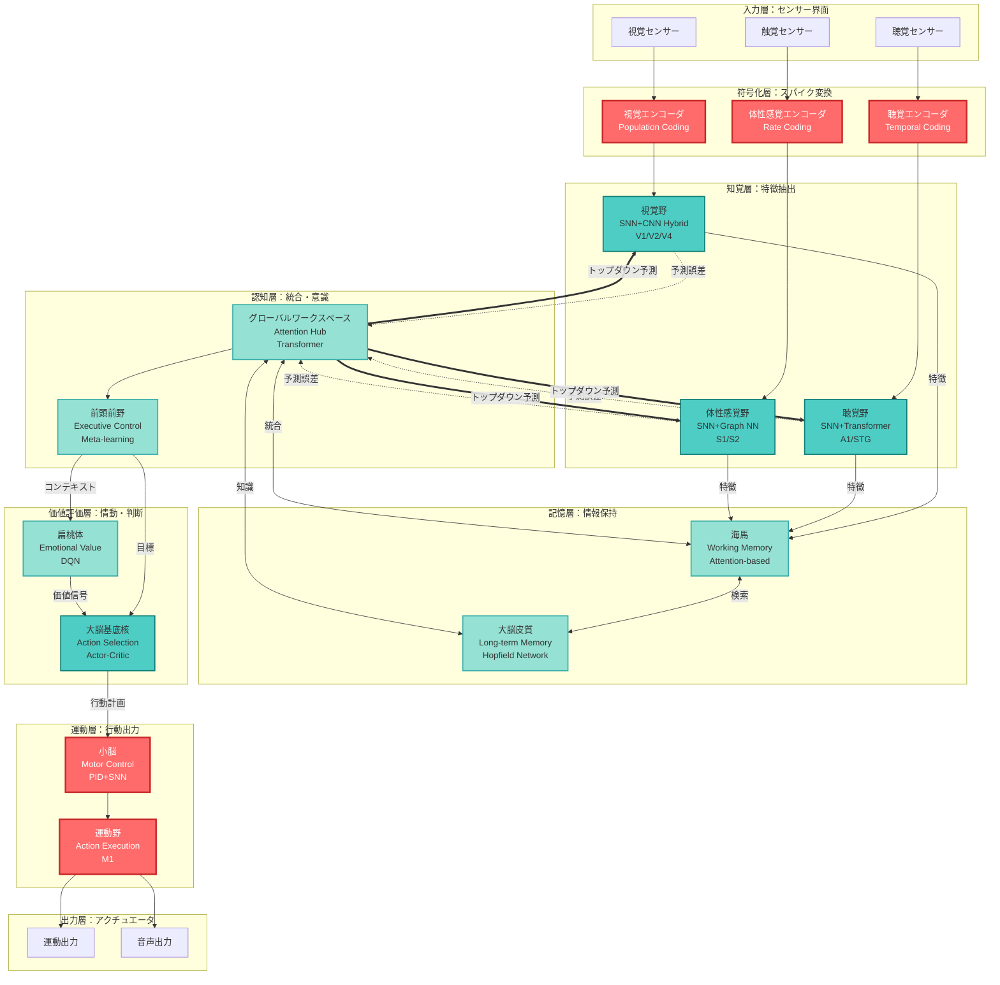
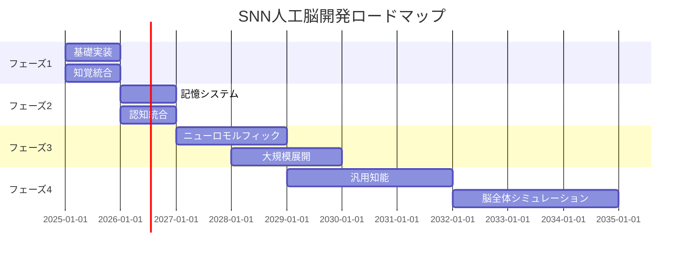

# SNN基盤人工脳アーキテクチャ：統合設計書

## エグゼクティブサマリー

本ドキュメントは、**スパイキングニューラルネットワーク（SNN）を通信基盤とした人工脳アーキテクチャ**の完全な設計指針を提示する。生物学的妥当性とデジタル実装可能性を両立させ、従来型AIの高度な認知機能とSNNの時間的・エネルギー効率性を統合することで、次世代の汎用人工知能システムの実現を目指す。

---

## 目次

1. [アーキテクチャ設計思想](#1-アーキテクチャ設計思想)
2. [全体システム構成](#2-全体システム構成)
3. [SNNコア実装設計](#3-snnコア実装設計)
4. [モジュール連携メカニズム](#4-モジュール連携メカニズム)
5. [学習アルゴリズム統合戦略](#5-学習アルゴリズム統合戦略)
6. [実装ロードマップ](#6-実装ロードマップ)
7. [評価・検証計画](#7-評価検証計画)
8. [将来展望](#8-将来展望)

---

## 1. アーキテクチャ設計思想

### 1.1 基本原理：機能分化と統合

人間の脳は単一の巨大プロセッサではなく、特化した機能モジュールの協調システムである。本アーキテクチャは以下の3原則に基づく：

1. **モジュール特化原則**: 各認知機能に最適なAIアーキテクチャを選定
2. **SNN統合原則**: 全モジュール間通信をSNNベースのスパイク通信で統一
3. **予測符号化原則**: 誤差駆動型の効率的情報伝達を実現

### 1.2 設計目標

| 目標分類 | 具体的指標 | 実現手段 |
|----------|------------|----------|
| **生物学的妥当性** | スパイクベース通信、STDP学習 | LIF/Izhikevichモデル採用 |
| **エネルギー効率** | 従来比1/100の消費電力 | イベント駆動処理 |
| **リアルタイム性** | <10ms応答時間 | 非同期並列処理 |
| **スケーラビリティ** | 10^9ニューロン規模 | ニューロモルフィックHW対応 |
| **認知性能** | 人間レベルのマルチモーダル理解 | ハイブリッドAI統合 |

### 1.3 Why SNN? - 3つの決定的利点

#### 1.3.1 時間的情報処理
- **因果関係の表現**: スパイクタイミングが情報そのもの
- **予測学習**: 未来予測と誤差検出を自然に実装
- **動的適応**: 環境変化に応じたリアルタイム調整

#### 1.3.2 エネルギー効率
```
従来ANN: 全ニューロンが毎ステップ計算 → O(N)
SNN: 発火したニューロンのみ計算 → O(活動率×N)
典型的な活動率: 1-5% → 20-100倍の効率化
```

#### 1.3.3 ニューロモルフィック実装適合性
- **Intel Loihi 2**: 1チップで100万ニューロン
- **IBM TrueNorth**: 1W以下で100万ニューロン
- **SpiNNaker**: 大規模並列スパイク処理

---

## 2. 全体システム構成

### 2.1 階層的モジュール構成図



### 2.2 モジュール詳細仕様

#### 2.2.1 知覚層（Perception Cortex）

**視覚野モジュール（V1/V2/V4）**
- **構成**: Spiking-CNN Hybrid
  - 初段: DVSカメラ入力 → SNN (LIF neurons)
  - 中段: Gabor Filter Bank (方向選択性)
  - 後段: Vision Transformer (高次特徴)
- **学習**: STDP (局所) + Backprop (全体)
- **出力**: 視覚特徴スパイクパターン
- **実装規模**: 100K neurons, 10M synapses

**聴覚野モジュール（A1/STG）**
- **構成**: SNN + Cochlear Model
  - 入力: 音声波形 → Cochleagram
  - SNN: Tonotopic Map (周波数マップ)
  - Transformer: 音素・単語認識
- **時間分解能**: 1ms
- **周波数範囲**: 20Hz-20kHz

**体性感覚野（S1/S2）**
- **構成**: SNN + Graph Neural Network
  - センサー配置: 3D空間グラフ
  - SNN: 触覚・圧力・温度の時系列処理
  - GNN: センサー間の空間的関係学習

#### 2.2.2 記憶層（Memory System）

**海馬（Hippocampus）- 短期・エピソード記憶**
- **容量**: 1000エピソード (リハーサル機構)
- **アーキテクチャ**: Attention-based Memory Network
  - CA3: Auto-associative Network (パターン完成)
  - CA1: Comparator (予測 vs 入力)
- **SNN連携**: スパイクパターンをメモリキーとして使用

**大脳皮質（Cortex）- 長期・意味記憶**
- **容量**: 無制限 (外部ストレージ連携)
- **実装**: Knowledge Graph + Hopfield Network
  - Entity: 概念ノード (100K+)
  - Relation: 意味的関係 (1M+)
- **検索**: スパイクパターン類似度ベース

#### 2.2.3 認知層（Cognitive Core）

**グローバルワークスペース（Global Workspace）**
- **役割**: 意識・注意・情報統合の中枢
- **機構**: Broadcasting Architecture
  ```
  入力: 各モジュールからの予測誤差スパイク
  処理: Multi-head Attention (誤差の重み付け統合)
  出力: 全モジュールへのトップダウン予測
  ```
- **注意機構**: Winner-Take-All SNN
  - 最も大きい誤差を持つモジュールに注意を集中
  - 他モジュールへの予測を強化

**前頭前野（Prefrontal Cortex）**
- **機能**: 実行制御・計画・メタ認知
- **実装**: Meta-learning Transformer
  - Task Representation: タスク埋め込み
  - Strategy Selection: 最適戦略の選択
  - Monitoring: 実行状態の監視

#### 2.2.4 価値評価・行動層

**扁桃体（Amygdala）- 情動価値**
- **入力**: 認知層からのコンテキスト
- **出力**: 情動価値スコア [-1, 1]
- **学習**: DQN (Deep Q-Network)

**大脳基底核（Basal Ganglia）- 行動選択**
- **構成**: Actor-Critic SNN
  - Direct Pathway: 行動促進
  - Indirect Pathway: 行動抑制
  - Substantia Nigra: ドーパミン信号 (報酬予測誤差)
- **学習**: TD-learning with eligibility traces

**小脳（Cerebellum）- 運動制御**
- **役割**: 精密な運動タイミング制御
- **構成**: Feedforward SNN + PID Controller
  - Granule Cells: 時間遅延線 (多様な時定数)
  - Purkinje Cells: 出力ニューロン
- **学習**: Supervised Hebbian Learning

---

## 3. SNNコア実装設計

### 3.1 ニューロンモデル選定

#### 3.1.1 モデル比較

| モデル | 方程式 | 計算量 | 表現力 | 用途 |
|--------|--------|--------|--------|------|
| **LIF** | τ dV/dt = -(V-Vrest) + RI | ⭐ | ⭐⭐ | 大規模層 |
| **Izhikevich** | dV/dt = 0.04V² + 5V + 140 - u + I<br/>du/dt = a(bV - u) | ⭐⭐ | ⭐⭐⭐⭐ | 中核層 |
| **AdEx** | C dV/dt = -gL(V-EL) + ΔT exp((V-VT)/ΔT) - w + I | ⭐⭐⭐ | ⭐⭐⭐⭐⭐ | 高精度層 |
| **HH** | 完全な4変数モデル | ⭐⭐⭐⭐⭐ | ⭐⭐⭐⭐⭐ | 生理学的研究 |

#### 3.1.2 採用方針

```python
# 層ごとの使い分け
network_config = {
    "encoding_layer": "LIF",          # 高速・大量処理
    "perception_layer": "Izhikevich",  # バランス重視
    "cognitive_layer": "AdEx",         # 高表現力
    "motor_layer": "Izhikevich"        # リアルタイム制御
}
```

### 3.2 シナプスモデル

#### 3.2.1 短期シナプス可塑性（STP）

**目的**: 時間的フィルタリング、情報の一時的強調

```python
# Tsodyks-Markram Model
class STP:
    def __init__(self):
        self.U = 0.5      # 利用率
        self.tau_rec = 100  # 回復時定数 (ms)
        self.tau_fac = 1000 # 促通時定数 (ms)
        self.x = 1.0      # 利用可能資源
        self.u = 0.0      # 利用率状態
    
    def update(self, spike, dt):
        if spike:
            self.u = self.u + self.U * (1 - self.u)
            syn_weight = self.u * self.x
            self.x = self.x - self.u * self.x
        else:
            syn_weight = 0
        
        # 回復過程
        self.x = self.x + (1 - self.x) / self.tau_rec * dt
        self.u = self.u - self.u / self.tau_fac * dt
        
        return syn_weight
```

#### 3.2.2 長期シナプス可塑性（LTP/LTD）

**実装**: STDP (Spike-Timing-Dependent Plasticity)

```python
class STDP:
    def __init__(self):
        self.A_plus = 0.01   # LTP学習率
        self.A_minus = 0.01  # LTD学習率
        self.tau_plus = 20   # LTP時定数
        self.tau_minus = 20  # LTD時定数
    
    def weight_update(self, dt_spike):
        """
        dt_spike: post - pre のスパイク時刻差 (ms)
        """
        if dt_spike > 0:  # Pre before Post → LTP
            dw = self.A_plus * np.exp(-dt_spike / self.tau_plus)
        else:  # Post before Pre → LTD
            dw = -self.A_minus * np.exp(dt_spike / self.tau_minus)
        
        return dw
```

### 3.3 符号化戦略

#### 3.3.1 入力符号化方式

**レート符号化（Rate Coding）**
```python
def rate_encoding(value, max_rate=100, duration=100):
    """
    value: [0, 1] の入力値
    max_rate: 最大発火率 (Hz)
    duration: 符号化期間 (ms)
    """
    rate = value * max_rate
    spike_times = np.random.poisson(rate * duration / 1000, size=1)
    return spike_times
```

**時間符号化（Temporal Coding）**
```python
def temporal_encoding(value, t_min=0, t_max=100):
    """
    value: [0, 1] の入力値
    大きい値ほど早く発火
    """
    spike_time = t_max - value * (t_max - t_min)
    return spike_time
```

**集団符号化（Population Coding）**
```python
def population_encoding(value, num_neurons=100):
    """
    ガウシアン受容野を持つニューロン群
    """
    centers = np.linspace(0, 1, num_neurons)
    sigma = 1.0 / num_neurons
    
    responses = np.exp(-((value - centers) ** 2) / (2 * sigma ** 2))
    spike_probs = responses / np.max(responses)
    
    spikes = np.random.rand(num_neurons) < spike_probs
    return spikes
```

#### 3.3.2 出力デコーディング

**スパイクカウント法**
```python
def spike_count_decoding(spike_train, window=100):
    """
    時間窓内のスパイク数を数える
    """
    count = np.sum(spike_train)
    return count / window  # 正規化された活動量
```

**重み付き集団投票法**
```python
def population_vector_decoding(spike_counts, preferred_values):
    """
    各ニューロンの選好値で重み付け平均
    """
    total_spikes = np.sum(spike_counts)
    if total_spikes == 0:
        return 0.0
    
    decoded_value = np.sum(spike_counts * preferred_values) / total_spikes
    return decoded_value
```

### 3.4 ネットワークトポロジー

#### 3.4.1 層構造設計

```python
class SNNLayer:
    def __init__(self, n_neurons, neuron_type="LIF"):
        self.n_neurons = n_neurons
        self.neurons = self._create_neurons(neuron_type)
        self.connectivity = None
    
    def _create_neurons(self, neuron_type):
        if neuron_type == "LIF":
            return [LIFNeuron() for _ in range(self.n_neurons)]
        elif neuron_type == "Izhikevich":
            return [IzhikevichNeuron() for _ in range(self.n_neurons)]
    
    def connect(self, target_layer, connection_prob=0.1, 
                weight_mean=0.5, weight_std=0.1):
        """
        確率的結合パターン
        """
        n_target = target_layer.n_neurons
        weights = np.random.randn(self.n_neurons, n_target) * weight_std + weight_mean
        mask = np.random.rand(self.n_neurons, n_target) < connection_prob
        self.connectivity = weights * mask
```

#### 3.4.2 リカレント接続と抑制

```python
class RecurrentSNN:
    def __init__(self, n_excitatory, n_inhibitory):
        self.exc_layer = SNNLayer(n_excitatory, "Izhikevich")
        self.inh_layer = SNNLayer(n_inhibitory, "LIF")
        
        # E→E, E→I, I→E 接続 (Dale's Principle)
        self.exc_layer.connect(self.exc_layer, 0.1, 0.5, 0.1)  # 興奮性
        self.exc_layer.connect(self.inh_layer, 0.5, 1.0, 0.2)  # 興奮→抑制
        self.inh_layer.connect(self.exc_layer, 0.5, -1.0, 0.2) # 抑制→興奮
```

---

## 4. モジュール連携メカニズム

### 4.1 連携における課題

| 課題タイプ | 具体的問題 | 影響 |
|------------|------------|------|
| **情報変換ロス** | CNN特徴マップ → Transformerトークン変換時の情報欠損 | 認識精度低下 |
| **セマンティックギャップ** | 各モジュールの内部表現の意味の不一致 | 誤解釈 |
| **時間的ミスマッチ** | リアルタイムSNN vs 低速Transformer | レイテンシ増大 |
| **学習の独立性** | モジュール個別最適化による全体性能劣化 | 協調失敗 |

### 4.2 解決策：予測符号化による統合

#### 4.2.1 基本原理

```
各モジュールは「世界モデル」を持つ:
1. 予測生成: 次の状態を予測
2. 誤差計算: 予測 vs 実際の差分
3. 誤差伝播: 他モジュールへ誤差情報のみ送信
4. 予測更新: 受信した誤差で予測を修正
```

#### 4.2.2 実装：階層的予測符号化

```python
class PredictiveCodingModule:
    def __init__(self, name, snn_interface):
        self.name = name
        self.snn = snn_interface  # SNNベース通信
        self.prediction_model = None  # 予測器
        self.world_state = None       # 内部状態
    
    def predict(self, top_down_signal):
        """
        上位層からの予測を受信し、自層の予測を生成
        """
        self.prediction = self.prediction_model(
            self.world_state, 
            top_down_signal
        )
        return self.prediction
    
    def compute_error(self, bottom_up_input):
        """
        下位層からの入力と予測の誤差を計算
        """
        error = bottom_up_input - self.prediction
        # 誤差が小さければスパイク発生しない（省エネ）
        if np.abs(error).mean() > self.threshold:
            error_spikes = self.snn.encode(error)
            return error_spikes
        return None  # 予測的中、通信不要
    
    def update_prediction(self, error_spikes):
        """
        誤差を受けて予測モデルを更新
        """
        error = self.snn.decode(error_spikes)
        self.prediction_model.update(error)
        self.world_state = self.world_state + error  # 状態修正
```

#### 4.2.3 モジュール間プロトコル

**スパイクメッセージフォーマット**
```python
class SpikeMessage:
    def __init__(self):
        self.source_module = ""      # 送信元
        self.target_module = ""      # 送信先
        self.message_type = ""       # "prediction" or "error"
        self.spike_pattern = None    # スパイク系列
        self.timestamp = 0           # 送信時刻
        self.priority = 0            # 優先度（誤差の大きさ）
```

**通信制御**
```python
class SNNCommunicationHub:
    def __init__(self):
        self.modules = {}
        self.message_queue = PriorityQueue()  # 優先度キュー
    
    def register_module(self, module):
        self.modules[module.name] = module
    
    def route_message(self, message):
        """
        予測符号化に基づくルーティング
        """
        # 誤差が大きいメッセージを優先
        priority = -message.priority  # 負値で大きい方が優先
        self.message_queue.put((priority, message))
    
    def process_messages(self, dt):
        """
        非同期メッセージ処理
        """
        while not self.message_queue.empty():
            _, message = self.message_queue.get()
            target = self.modules[message.target_module]
            
            if message.message_type == "error":
                target.update_prediction(message.spike_pattern)
            elif message.message_type == "prediction":
                target.predict(message.spike_pattern)
```

### 4.3 共通表現空間（Common Representational Space）

#### 4.3.1 設計思想

全モジュールが読み書きできる高次元ベクトル空間を導入し、モダリティ横断的な情報統合を実現。

```python
class CommonSpace:
    def __init__(self, dimension=512):
        self.dim = dimension
        self.space = np.zeros(dimension)
        self.encoders = {}  # モジュール別エンコーダ
        self.decoders = {}  # モジュール別デコーダ
    
    def register_module(self, module_name, encoder, decoder):
        """
        各モジュールの変換器を登録
        """
        self.encoders[module_name] = encoder
        self.decoders[module_name] = decoder
    
    def write(self, module_name, data):
        """
        モジュール固有データを共通空間へ投影
        """
        encoded = self.encoders[module_name](data)
        self.space = self.space + encoded  # 加算統合
    
    def read(self, module_name):
        """
        共通空間から取り出し、モジュール固有形式へ変換
        """
        decoded = self.decoders[module_name](self.space)
        return decoded
```

#### 4.3.2 マルチモーダル統合例

```python
# 視覚と言語の統合（CLIPスタイル）
common_space = CommonSpace(dimension=512)

# 視覚エンコーダ（CNN → 共通空間）
vision_encoder = lambda img: cnn_model(img).flatten()
vision_decoder = lambda vec: deconv_model(vec.reshape(img_shape))

# 言語エンコーダ（Transformer → 共通空間）
language_encoder = lambda text: transformer_model(text)[:, 0, :]  # [CLS]
language_decoder = lambda vec: transformer_decoder(vec)

common_space.register_module("vision", vision_encoder, vision_decoder)
common_space.register_module("language", language_encoder, language_decoder)

# 統合処理
common_space.write("vision", camera_image)
common_space.write("language", text_description)

# 視覚情報を言語で読み出し
linguistic_description = common_space.read("language")
```

### 4.4 End-to-End学習による連携最適化

#### 4.4.1 全体誤差のバックプロパゲーション

```python
class HybridBrain:
    def __init__(self):
        self.perception = PerceptionModule()
        self.memory = MemoryModule()
        self.cognition = CognitionModule()
        self.action = ActionModule()
        self.snn_hub = SNNCommunicationHub()
    
    def forward(self, sensory_input):
        # ボトムアップ処理
        features = self.perception(sensory_input)
        context = self.memory.retrieve(features)
        decision = self.cognition.integrate(features, context)
        action = self.action.select(decision)
        return action
    
    def backward(self, task_error):
        """
        タスク誤差を全モジュールに配分
        """
        # 誤差を逆伝播
        action_grad = self.action.backward(task_error)
        cognition_grad = self.cognition.backward(action_grad)
        
        # 記憶システムとの連携も更新
        memory_grad, feature_grad = self.memory.backward(cognition_grad)
        perception_grad = self.perception.backward(feature_grad)
        
        # SNN通信層も最適化
        self.snn_hub.update_routing(task_error)
```

---

## 5. 学習アルゴリズム統合戦略

### 5.1 学習方式の比較と統合

#### 5.1.1 三大学習アプローチ

| 学習法 | 原理 | 生物学的妥当性 | 計算効率 | 精度 | 適用層 |
|--------|------|----------------|----------|------|--------|
| **STDP** | スパイクタイミング依存可塑性 | ⭐⭐⭐⭐⭐ | ⭐⭐⭐⭐ | ⭐⭐ | 知覚・運動 |
| **Surrogate Gradient** | 擬似勾配による誤差逆伝播 | ⭐⭐ | ⭐⭐⭐ | ⭐⭐⭐⭐⭐ | 全層 |
| **Reward-modulated STDP** | 報酬信号による可塑性調整 | ⭐⭐⭐⭐ | ⭐⭐⭐ | ⭐⭐⭐ | 価値評価・行動 |
| **ANN→SNN Conversion** | 学習済みANNをSNN化 | ⭐ | ⭐⭐⭐⭐⭐ | ⭐⭐⭐⭐ | 初期モデル |

#### 5.1.2 統合学習戦略

**階層的学習パイプライン**

```python
class HierarchicalLearning:
    def __init__(self, brain_model):
        self.brain = brain_model
        self.learning_phases = [
            "phase1_local_stdp",
            "phase2_supervised_tuning", 
            "phase3_reinforcement_learning",
            "phase4_continual_adaptation"
        ]
    
    def phase1_local_stdp(self, sensory_data, epochs=1000):
        """
        フェーズ1: 教師なし局所学習
        目的: 基本的な特徴検出器の自己組織化
        """
        for epoch in range(epochs):
            for data in sensory_data:
                # 各層で独立にSTDP学習
                self.brain.perception.apply_stdp(data)
                self.brain.memory.apply_stdp(data)
        
        print("Phase 1 Complete: 局所特徴検出器が形成されました")
    
    def phase2_supervised_tuning(self, labeled_data, epochs=500):
        """
        フェーズ2: 教師あり微調整
        目的: タスク特化型の精度向上
        """
        optimizer = SurrogateGradientOptimizer(self.brain)
        
        for epoch in range(epochs):
            total_loss = 0
            for data, label in labeled_data:
                output = self.brain.forward(data)
                loss = cross_entropy_loss(output, label)
                
                # Surrogate Gradientで逆伝播
                grads = optimizer.compute_gradients(loss)
                optimizer.apply_gradients(grads)
                
                total_loss += loss
            
            print(f"Epoch {epoch}: Loss = {total_loss:.4f}")
        
        print("Phase 2 Complete: 教師あり学習完了")
    
    def phase3_reinforcement_learning(self, environment, episodes=10000):
        """
        フェーズ3: 強化学習
        目的: 行動ポリシーの獲得
        """
        for episode in range(episodes):
            state = environment.reset()
            episode_reward = 0
            
            while not environment.done:
                # 行動選択
                action = self.brain.action.select(state)
                next_state, reward, done = environment.step(action)
                
                # TD誤差計算
                td_error = reward + self.brain.value.predict(next_state) \
                           - self.brain.value.predict(state)
                
                # Reward-modulated STDP
                self.brain.action.update_with_reward(td_error)
                
                state = next_state
                episode_reward += reward
            
            if episode % 100 == 0:
                print(f"Episode {episode}: Reward = {episode_reward}")
        
        print("Phase 3 Complete: 行動ポリシー獲得")
    
    def phase4_continual_adaptation(self):
        """
        フェーズ4: 継続的適応
        目的: 運用中の環境変化への対応
        """
        # メタ学習的なアプローチ
        self.brain.enable_online_learning()
        print("Phase 4 Active: オンライン学習モード")
```

### 5.2 Surrogate Gradient実装詳細

#### 5.2.1 スパイク関数の微分可能近似

```python
import torch
import torch.nn as nn

class SurrogateGradientSpike(torch.autograd.Function):
    """
    スパイク発火関数の微分可能近似
    """
    @staticmethod
    def forward(ctx, input, threshold=1.0):
        """
        順伝播: 通常のスパイク発火
        """
        ctx.save_for_backward(input)
        ctx.threshold = threshold
        return (input > threshold).float()
    
    @staticmethod
    def backward(ctx, grad_output):
        """
        逆伝播: 擬似勾配を使用
        """
        input, = ctx.saved_tensors
        threshold = ctx.threshold
        
        # Fast Sigmoid近似
        grad_input = grad_output / (1 + torch.abs(input - threshold))
        
        return grad_input, None

# 使用例
spike_fn = SurrogateGradientSpike.apply

class LIFNeuronLayer(nn.Module):
    def __init__(self, n_neurons, tau=20.0, threshold=1.0):
        super().__init__()
        self.n_neurons = n_neurons
        self.tau = tau
        self.threshold = threshold
        self.membrane = None
    
    def forward(self, input_current, dt=1.0):
        if self.membrane is None:
            self.membrane = torch.zeros_like(input_current)
        
        # LIFダイナミクス
        self.membrane = self.membrane + (
            -self.membrane + input_current
        ) * dt / self.tau
        
        # 微分可能なスパイク発生
        spikes = spike_fn(self.membrane, self.threshold)
        
        # リセット
        self.membrane = self.membrane * (1 - spikes)
        
        return spikes
```

#### 5.2.2 時間展開バックプロパゲーション

```python
class BPTT_SNN(nn.Module):
    """
    時間展開による誤差逆伝播（BPTT）
    """
    def __init__(self, input_size, hidden_size, output_size):
        super().__init__()
        self.fc1 = nn.Linear(input_size, hidden_size)
        self.lif1 = LIFNeuronLayer(hidden_size)
        self.fc2 = nn.Linear(hidden_size, output_size)
        self.lif2 = LIFNeuronLayer(output_size)
    
    def forward(self, input_spikes, time_steps=100):
        """
        時間展開して処理
        """
        batch_size = input_spikes.size(0)
        outputs = []
        
        # 初期化
        self.lif1.membrane = torch.zeros(batch_size, self.lif1.n_neurons)
        self.lif2.membrane = torch.zeros(batch_size, self.lif2.n_neurons)
        
        # 時間ステップごとに処理
        for t in range(time_steps):
            x = input_spikes[:, t, :]
            x = self.fc1(x)
            x = self.lif1(x)
            x = self.fc2(x)
            x = self.lif2(x)
            outputs.append(x)
        
        # 時間軸でスタック
        return torch.stack(outputs, dim=1)
    
    def train_step(self, input_spikes, target, optimizer):
        """
        学習ステップ
        """
        optimizer.zero_grad()
        
        # 順伝播
        output_spikes = self.forward(input_spikes)
        
        # スパイクカウントで分類
        spike_counts = output_spikes.sum(dim=1)  # 時間軸で合計
        
        # 損失計算
        loss = nn.functional.cross_entropy(spike_counts, target)
        
        # 逆伝播
        loss.backward()
        optimizer.step()
        
        return loss.item()
```

### 5.3 STDP実装の最適化

#### 5.3.1 トレース更新による効率化

```python
class EfficientSTDP:
    """
    トレース（痕跡）を用いた効率的STDP実装
    """
    def __init__(self, n_pre, n_post, tau_plus=20, tau_minus=20):
        self.weights = np.random.randn(n_pre, n_post) * 0.1
        self.tau_plus = tau_plus
        self.tau_minus = tau_minus
        
        # トレース（発火の履歴）
        self.pre_trace = np.zeros(n_pre)
        self.post_trace = np.zeros(n_post)
        
        # 学習率
        self.A_plus = 0.01
        self.A_minus = 0.01
    
    def update_traces(self, pre_spikes, post_spikes, dt=1.0):
        """
        トレースの時間減衰
        """
        self.pre_trace *= np.exp(-dt / self.tau_plus)
        self.post_trace *= np.exp(-dt / self.tau_minus)
        
        # スパイク発生時にトレース増加
        self.pre_trace += pre_spikes
        self.post_trace += post_spikes
    
    def apply_stdp(self, pre_spikes, post_spikes, dt=1.0):
        """
        STDP学習規則の適用
        """
        # トレース更新
        self.update_traces(pre_spikes, post_spikes, dt)
        
        # 重み更新
        # LTP: post発火時、preトレースが残っていれば強化
        dw_plus = np.outer(self.pre_trace, post_spikes) * self.A_plus
        
        # LTD: pre発火時、postトレースが残っていれば弱化
        dw_minus = np.outer(pre_spikes, self.post_trace) * self.A_minus
        
        self.weights += dw_plus - dw_minus
        
        # 重み制約
        self.weights = np.clip(self.weights, 0, 1)
```

#### 5.3.2 三要素STDPによる報酬学習

```python
class RewardModulatedSTDP:
    """
    報酬信号で調整されるSTDP（ドーパミン様）
    """
    def __init__(self, stdp_module):
        self.stdp = stdp_module
        self.eligibility_trace = np.zeros_like(self.stdp.weights)
        self.tau_eligibility = 1000  # 適格性トレースの時定数
    
    def update(self, pre_spikes, post_spikes, reward, dt=1.0):
        """
        報酬変調STDP更新
        """
        # 標準STDP計算（ただし適用はしない）
        dw_stdp = self.stdp.compute_weight_change(pre_spikes, post_spikes)
        
        # 適格性トレースに蓄積
        self.eligibility_trace += dw_stdp
        self.eligibility_trace *= np.exp(-dt / self.tau_eligibility)
        
        # 報酬到着時に適格性トレースを重みに反映
        if reward != 0:
            self.stdp.weights += reward * self.eligibility_trace
            self.eligibility_trace *= 0  # リセット
```

### 5.4 ハイブリッド学習アーキテクチャ

#### 5.4.1 局所学習とグローバル学習の共存

```python
class HybridLearningBrain:
    """
    局所的STDP学習とグローバル誤差逆伝播の統合
    """
    def __init__(self):
        self.local_layers = []   # STDP学習層
        self.global_layers = []  # Backprop学習層
        self.interface_layer = None  # 接続層
    
    def forward_local(self, input_data):
        """
        局所学習部分の順伝播（STDP駆動）
        """
        activation = input_data
        for layer in self.local_layers:
            activation = layer.forward(activation)
            # オンラインSTDP更新
            if self.training:
                layer.apply_stdp()
        return activation
    
    def forward_global(self, local_features):
        """
        グローバル学習部分の順伝播
        """
        activation = self.interface_layer(local_features)
        for layer in self.global_layers:
            activation = layer(activation)
        return activation
    
    def backward_global(self, loss):
        """
        グローバル部分のバックプロパゲーション
        """
        loss.backward()
        
        # インターフェース層の勾配を取得
        interface_grad = self.interface_layer.weight.grad
        
        # 局所層への影響を計算（フィードバック信号）
        feedback_signal = self.compute_feedback(interface_grad)
        
        return feedback_signal
    
    def compute_feedback(self, global_grad):
        """
        グローバル誤差を局所層へのフィードバックに変換
        """
        # 誤差の大きさに応じて局所学習率を調整
        feedback_magnitude = torch.norm(global_grad)
        
        for layer in self.local_layers:
            layer.modulate_learning_rate(feedback_magnitude)
        
        return feedback_magnitude
```

---

## 6. 実装ロードマップ

### 6.1 開発フェーズ

#### フェーズ0: 基盤構築（1-2ヶ月）

**目標**: SNNシミュレーション環境の確立

| タスク | 実装内容 | 期待成果 | 検証方法 |
|--------|----------|----------|----------|
| ニューロンモデル実装 | LIF, Izhikevich, AdEx | 3種類のモデルライブラリ | 単体テスト |
| シナプス可塑性 | STDP, STP実装 | 学習機構の動作確認 | XOR学習 |
| 符号化/復号化 | 3種類の符号化方式 | 情報表現の多様性 | 再構成精度 |
| 基本ネットワーク | 3層FF-SNN | 基本分類タスク | MNIST-like |

**技術スタック**
```python
# 推奨ライブラリ
core_libraries = {
    "simulation": ["Brian2", "NEST", "BindsNET"],
    "deep_learning": ["PyTorch", "Norse", "snnTorch"],
    "visualization": ["matplotlib", "nengo_gui"],
    "hardware": ["Intel Loihi SDK (将来)"]
}
```

#### フェーズ1: 知覚モジュール構築（2-3ヶ月）

**目標**: 視覚・聴覚野の実装

**マイルストーン**
1. **DVS視覚処理**
   - N-MNIST認識: >95%精度
   - DVS Gesture認識: >90%精度
   - レイテンシ: <50ms

2. **音声処理**
   - Speech Commands認識: >85%精度
   - リアルタイム処理: 10ms以下

**実装例：視覚野V1モジュール**
```python
class V1_Module:
    def __init__(self):
        # Gabor Filter Bank (方向選択性)
        self.gabor_filters = self._create_gabor_bank(
            n_orientations=8,
            n_scales=4
        )
        
        # LIF Simple Cells
        self.simple_cells = SNNLayer(
            n_neurons=10000,
            neuron_type="LIF"
        )
        
        # Complex Cells (位置不変性)
        self.complex_cells = SNNLayer(
            n_neurons=1000,
            neuron_type="Izhikevich"
        )
    
    def process_dvs_stream(self, events):
        """
        DVSイベントストリーム処理
        """
        # Gabor畳み込み
        oriented_features = []
        for gabor in self.gabor_filters:
            response = self._convolve_dvs(events, gabor)
            oriented_features.append(response)
        
        # Simple Cells応答
        simple_spikes = self.simple_cells.forward(oriented_features)
        
        # Complex Cells統合（max-pooling的）
        complex_spikes = self.complex_cells.forward(simple_spikes)
        
        return complex_spikes
```

#### フェーズ2: 記憶システム統合（2-3ヶ月）

**目標**: 短期・長期記憶の実装

**サブシステム**

1. **Working Memory（海馬CA3）**
```python
class WorkingMemory:
    def __init__(self, capacity=100):
        self.capacity = capacity
        self.buffer = []
        self.attention_weights = None
    
    def store(self, spike_pattern):
        """
        スパイクパターンをエピソードとして保存
        """
        if len(self.buffer) >= self.capacity:
            # 重要度の低いものを削除（Replay機構）
            self.buffer.pop(0)
        
        self.buffer.append({
            'pattern': spike_pattern,
            'timestamp': time.time(),
            'rehearsal_count': 0
        })
    
    def retrieve(self, query_pattern, top_k=5):
        """
        クエリに類似したパターンを検索
        """
        similarities = []
        for memory in self.buffer:
            sim = self._spike_similarity(query_pattern, memory['pattern'])
            similarities.append(sim)
        
        # Top-K取得
        indices = np.argsort(similarities)[-top_k:]
        retrieved = [self.buffer[i] for i in indices]
        
        # Rehearsal（想起されたものは強化）
        for i in indices:
            self.buffer[i]['rehearsal_count'] += 1
        
        return retrieved
    
    def _spike_similarity(self, pattern1, pattern2):
        """
        van Rossum距離によるスパイク類似度
        """
        # 簡易実装：スパイクタイミングの相互相関
        correlation = np.correlate(pattern1, pattern2, mode='valid')
        return np.max(correlation)
```

2. **Long-term Memory（Knowledge Graph）**
```python
class SemanticMemory:
    def __init__(self):
        self.graph = nx.DiGraph()  # NetworkX
        self.embeddings = {}       # ノード埋め込み
    
    def add_concept(self, concept_name, spike_pattern):
        """
        新しい概念を追加
        """
        node_id = len(self.graph.nodes)
        self.graph.add_node(node_id, name=concept_name)
        self.embeddings[node_id] = spike_pattern
    
    def add_relation(self, concept1, concept2, relation_type):
        """
        概念間の関係を追加
        """
        self.graph.add_edge(
            concept1, concept2,
            relation=relation_type
        )
    
    def query(self, spike_pattern, depth=2):
        """
        スパイクパターンから関連概念を検索
        """
        # 最も類似したノードを見つける
        similarities = {
            node: self._pattern_similarity(spike_pattern, emb)
            for node, emb in self.embeddings.items()
        }
        
        start_node = max(similarities, key=similarities.get)
        
        # グラフ探索（BFS）
        related_concepts = nx.single_source_shortest_path_length(
            self.graph, start_node, cutoff=depth
        )
        
        return related_concepts
```

#### フェーズ3: 認知・意思決定統合（3-4ヶ月）

**目標**: グローバルワークスペースと行動選択の実装

**核心コンポーネント**

1. **Global Workspace Theory実装**
```python
class GlobalWorkspace:
    def __init__(self, n_modules=5):
        self.modules = {}
        self.attention_mechanism = AttentionHub()
        self.broadcast_buffer = None
    
    def register_module(self, name, module):
        """
        モジュールを登録
        """
        self.modules[name] = module
    
    def conscious_broadcast(self):
        """
        意識的放送：注意を得た情報を全モジュールに配信
        """
        # 各モジュールから誤差信号を収集
        error_signals = {}
        for name, module in self.modules.items():
            error_signals[name] = module.get_prediction_error()
        
        # 注意機構で最も重要な情報を選択
        winner = self.attention_mechanism.select(error_signals)
        
        # 勝者の情報を全モジュールに放送
        self.broadcast_buffer = self.modules[winner].get_state()
        
        for name, module in self.modules.items():
            if name != winner:
                module.receive_broadcast(self.broadcast_buffer)
        
        return winner

class AttentionHub:
    """
    Winner-Take-All競合による注意選択
    """
    def __init__(self):
        self.history = []
        self.inhibition_strength = 0.5
    
    def select(self, signals):
        """
        最大誤差を持つモジュールを選択
        """
        # 過去の勝者には抑制をかける（Inhibition of Return）
        adjusted_signals = {}
        for name, signal in signals.items():
            inhibition = self._get_inhibition(name)
            adjusted_signals[name] = signal * (1 - inhibition)
        
        winner = max(adjusted_signals, key=adjusted_signals.get)
        self.history.append(winner)
        
        return winner
    
    def _get_inhibition(self, module_name):
        """
        最近勝利したモジュールは抑制
        """
        recent_wins = self.history[-5:]  # 直近5回
        win_count = recent_wins.count(module_name)
        return self.inhibition_strength * (win_count / 5)
```

2. **Actor-Critic行動選択**
```python
class ActorCriticSNN:
    """
    SNNベースのActor-Critic強化学習
    """
    def __init__(self, state_dim, action_dim):
        # Actor: 行動ポリシー
        self.actor = SNNNetwork(
            input_dim=state_dim,
            hidden_dim=256,
            output_dim=action_dim
        )
        
        # Critic: 価値関数
        self.critic = SNNNetwork(
            input_dim=state_dim,
            hidden_dim=128,
            output_dim=1
        )
        
        self.gamma = 0.99  # 割引率
    
    def select_action(self, state_spikes):
        """
        状態に基づいて行動を選択
        """
        action_spikes = self.actor.forward(state_spikes)
        
        # スパイクカウントを行動確率に変換
        spike_counts = action_spikes.sum(dim=-1)
        action_probs = torch.softmax(spike_counts, dim=-1)
        
        # 確率的サンプリング
        action = torch.multinomial(action_probs, 1)
        return action, action_probs
    
    def update(self, state, action, reward, next_state, done):
        """
        TD学習による更新
        """
        # 現在の価値
        V_current = self.critic.forward(state)
        
        # 次状態の価値
        if not done:
            V_next = self.critic.forward(next_state)
            target = reward + self.gamma * V_next
        else:
            target = reward
        
        # TD誤差
        td_error = target - V_current
        
        # Criticの更新
        critic_loss = td_error ** 2
        critic_loss.backward()
        
        # Actorの更新（policy gradient）
        _, action_probs = self.select_action(state)
        log_prob = torch.log(action_probs[action])
        actor_loss = -log_prob * td_error.detach()
        actor_loss.backward()
        
        return td_error.item()
```

#### フェーズ4: 全体統合と最適化（2-3ヶ月）

**目標**: エンドツーエンドシステムの完成

**統合タスク**
1. モジュール間通信の最適化
2. 予測符号化の全面実装
3. リアルタイム性能の達成
4. ニューロモルフィックHW対応

**ベンチマークタスク**
- **Atari Games**: 視覚運動統合
- **OpenAI Gym Robotics**: 連続制御
- **Visual Question Answering**: マルチモーダル推論

### 6.2 開発環境セットアップ

#### 推奨構成

```bash
# Python環境
python 3.9+
pytorch 2.0+
norse 0.0.7+        # PyTorch SNNライブラリ
snntorch 0.6.0+     # SNNシミュレーション
brian2 2.5+         # 詳細シミュレーション

# 可視化
matplotlib
seaborn
tensorboard
nengo-gui           # インタラクティブSNN可視化

# ハードウェアアクセラレーション
cuda 11.8+          # GPU
intel-npu-driver    # Intel Loihi (optional)
```

#### Docker環境例

```dockerfile
FROM pytorch/pytorch:2.0.0-cuda11.7-cudnn8-devel

RUN pip install norse snntorch brian2 networkx \
    matplotlib seaborn tensorboard

# ニューロモルフィックツール (optional)
# RUN pip install nxsdk  # Intel Loihi SDK

WORKDIR /workspace
CMD ["jupyter", "lab", "--ip=0.0.0.0", "--allow-root"]
```

---

## 7. 評価・検証計画

### 7.1 評価指標体系

#### 7.1.1 性能指標

| カテゴリ | 指標 | 測定方法 | 目標値 |
|----------|------|----------|--------|
| **認識精度** | Accuracy | テストセット評価 | >95% (N-MNIST) |
| **推論速度** | Latency | エンドツーエンド時間 | <10ms |
| **エネルギー** | Energy/Inference | 消費電力×時間 | <10mJ |
| **神経効率** | Spikes/Inference | 総スパイク数 | <10^5 |
| **メモリ** | Model Size | パラメータ数 | <10M params |

#### 7.1.2 生物学的妥当性指標

```python
class BiologicalPlausibilityMetrics:
    """
    生物学的妥当性の評価
    """
    def __init__(self, snn_model):
        self.model = snn_model
    
    def firing_rate_distribution(self):
        """
        発火率分布の生物学的妥当性
        目標: 対数正規分布に従うべき
        """
        rates = self.model.get_all_firing_rates()
        # 対数正規分布へのフィッティング
        mu, sigma = scipy.stats.lognorm.fit(rates)
        
        # KLダイバージェンスで評価
        kl_div = self._compute_kl_divergence(rates, mu, sigma)
        return kl_div
    
    def temporal_correlation(self):
        """
        時間的相関構造
        目標: 長距離相関を持つべき
        """
        spike_trains = self.model.record_spikes(duration=10000)
        
        # 自己相関関数
        acf = self._compute_autocorrelation(spike_trains)
        
        # べき乗則の確認
        exponent = self._fit_power_law(acf)
        return exponent
    
    def energy_efficiency(self):
        """
        エネルギー効率性
        目標: 活動率1-5%程度
        """
        total_neurons = self.model.count_neurons()
        active_neurons = self.model.count_active_neurons()
        
        activity_rate = active_neurons / total_neurons
        return activity_rate
```

### 7.2 ベンチマークスイート

#### 7.2.1 段階的評価タスク

| レベル | タスク | データセット | 評価対象 | 合格基準 |
|--------|--------|-------------|----------|----------|
| **L1: 基礎** | 静的画像分類 | MNIST, Fashion-MNIST | 符号化・基本学習 | >98% |
| **L2: 時間的** | イベント認識 | N-MNIST, DVS128 Gesture | 時間的符号化 | >90% |
| **L3: 複雑** | 動画理解 | UCF-101, Kinetics | 時空間統合 | >75% |
| **L4: マルチモーダル** | VQA | CLEVR, VQA v2 | モジュール連携 | >60% |
| **L5: 行動** | 連続制御 | MuJoCo, Atari | 強化学習 | 人間レベル |
| **L6: 汎用** | Meta-learning | Meta-World, Omniglot | 適応性 | Few-shot学習 |

#### 7.2.2 評価プロトコル実装

```python
class BenchmarkSuite:
    """
    包括的ベンチマーク評価システム
    """
    def __init__(self, model):
        self.model = model
        self.results = {}
    
    def run_all_benchmarks(self):
        """
        全ベンチマークを実行
        """
        benchmarks = [
            ("L1_MNIST", self.eval_mnist),
            ("L2_DVS_Gesture", self.eval_dvs_gesture),
            ("L3_UCF101", self.eval_video_classification),
            ("L4_VQA", self.eval_visual_qa),
            ("L5_Atari", self.eval_atari),
            ("L6_MetaLearning", self.eval_meta_learning)
        ]
        
        for name, benchmark_fn in benchmarks:
            print(f"\n{'='*50}")
            print(f"Running: {name}")
            print(f"{'='*50}")
            
            result = benchmark_fn()
            self.results[name] = result
            
            self._print_result(name, result)
        
        self._generate_report()
    
    def eval_mnist(self):
        """
        L1: MNIST分類
        """
        from torchvision import datasets, transforms
        
        # データ準備
        test_dataset = datasets.MNIST(
            './data', train=False, download=True,
            transform=transforms.ToTensor()
        )
        test_loader = torch.utils.data.DataLoader(
            test_dataset, batch_size=100, shuffle=False
        )
        
        # 評価
        correct = 0
        total = 0
        latencies = []
        energies = []
        
        for images, labels in test_loader:
            start_time = time.time()
            
            # 推論
            outputs = self.model(images)
            
            latency = (time.time() - start_time) * 1000  # ms
            latencies.append(latency)
            
            # エネルギー測定
            energy = self.model.get_energy_consumption()
            energies.append(energy)
            
            # 精度計算
            predictions = outputs.argmax(dim=1)
            correct += (predictions == labels).sum().item()
            total += labels.size(0)
        
        return {
            'accuracy': correct / total,
            'avg_latency': np.mean(latencies),
            'avg_energy': np.mean(energies),
            'total_spikes': self.model.get_total_spikes()
        }
    
    def eval_dvs_gesture(self):
        """
        L2: DVSジェスチャー認識
        """
        from tonic.datasets import DVSGesture
        
        dataset = DVSGesture('./data/dvs')
        loader = torch.utils.data.DataLoader(
            dataset, batch_size=1, shuffle=False
        )
        
        correct = 0
        total = 0
        
        for events, label in loader:
            # イベント駆動処理
            output = self.model.process_events(events)
            prediction = output.argmax()
            
            correct += (prediction == label).item()
            total += 1
        
        return {
            'accuracy': correct / total,
            'event_efficiency': self.model.get_event_efficiency()
        }
    
    def eval_visual_qa(self):
        """
        L4: Visual Question Answering
        """
        # CLEVR-like dataset
        dataset = load_clevr_dataset('./data/clevr')
        
        correct = 0
        total = 0
        
        for sample in dataset:
            image = sample['image']
            question = sample['question']
            answer = sample['answer']
            
            # マルチモーダル推論
            prediction = self.model.answer_question(image, question)
            
            if prediction == answer:
                correct += 1
            total += 1
        
        return {
            'accuracy': correct / total,
            'module_communication_efficiency': 
                self.model.get_communication_metrics()
        }
    
    def eval_atari(self, env_name='Pong', episodes=100):
        """
        L5: Atari強化学習
        """
        import gym
        
        env = gym.make(f'ALE/{env_name}-v5')
        rewards = []
        
        for episode in range(episodes):
            state = env.reset()
            episode_reward = 0
            done = False
            
            while not done:
                action = self.model.select_action(state)
                next_state, reward, done, _ = env.step(action)
                episode_reward += reward
                state = next_state
            
            rewards.append(episode_reward)
        
        return {
            'mean_reward': np.mean(rewards),
            'std_reward': np.std(rewards),
            'human_normalized_score': np.mean(rewards) / HUMAN_SCORES[env_name]
        }
    
    def _generate_report(self):
        """
        総合レポート生成
        """
        print("\n" + "="*70)
        print("BENCHMARK SUMMARY")
        print("="*70)
        
        for benchmark_name, result in self.results.items():
            print(f"\n{benchmark_name}:")
            for metric, value in result.items():
                print(f"  {metric}: {value:.4f}")
        
        # 総合スコア計算
        overall_score = self._compute_overall_score()
        print(f"\n{'='*70}")
        print(f"OVERALL SCORE: {overall_score:.2f}/100")
        print(f"{'='*70}")
```

### 7.3 アブレーション研究（Ablation Study）

#### 7.3.1 コンポーネント重要性分析

```python
class AblationStudy:
    """
    各コンポーネントの貢献度を測定
    """
    def __init__(self, full_model):
        self.full_model = full_model
        self.baseline_performance = None
    
    def run_ablation(self):
        """
        体系的にコンポーネントを除外して評価
        """
        # ベースライン測定
        self.baseline_performance = self._evaluate(self.full_model)
        print(f"Baseline: {self.baseline_performance:.4f}")
        
        ablation_results = {}
        
        # 各コンポーネントを無効化
        components = [
            ("STDP Learning", lambda m: m.disable_stdp()),
            ("Predictive Coding", lambda m: m.disable_prediction()),
            ("SNN Communication", lambda m: m.disable_snn_comm()),
            ("Working Memory", lambda m: m.disable_working_memory()),
            ("Attention Mechanism", lambda m: m.disable_attention()),
            ("Reward Modulation", lambda m: m.disable_reward_mod())
        ]
        
        for component_name, disable_fn in components:
            # モデルのコピーを作成
            model_copy = copy.deepcopy(self.full_model)
            
            # コンポーネント無効化
            disable_fn(model_copy)
            
            # 評価
            performance = self._evaluate(model_copy)
            
            # 性能低下を計算
            degradation = self.baseline_performance - performance
            ablation_results[component_name] = {
                'performance': performance,
                'degradation': degradation,
                'importance': degradation / self.baseline_performance
            }
            
            print(f"{component_name}: {performance:.4f} "
                  f"(-{degradation:.4f}, {ablation_results[component_name]['importance']:.2%})")
        
        return ablation_results
    
    def visualize_importance(self, results):
        """
        コンポーネント重要性の可視化
        """
        import matplotlib.pyplot as plt
        
        components = list(results.keys())
        importances = [results[c]['importance'] for c in components]
        
        plt.figure(figsize=(10, 6))
        plt.barh(components, importances)
        plt.xlabel('Relative Importance')
        plt.title('Component Ablation Study')
        plt.tight_layout()
        plt.savefig('ablation_study.png')
```

### 7.4 比較分析

#### 7.4.1 従来手法との比較

```python
class ComparativeAnalysis:
    """
    従来型AI vs SNN-based AI の比較
    """
    def compare_architectures(self):
        """
        複数アーキテクチャの包括的比較
        """
        architectures = {
            'SNN_Brain (Ours)': self.snn_brain_model,
            'Pure CNN': self.baseline_cnn,
            'Vision Transformer': self.vit_model,
            'LSTM': self.lstm_model,
            'Hybrid (CNN+RNN)': self.hybrid_baseline
        }
        
        metrics = ['accuracy', 'latency', 'energy', 'params']
        results = {}
        
        for name, model in architectures.items():
            results[name] = {
                'accuracy': self._measure_accuracy(model),
                'latency': self._measure_latency(model),
                'energy': self._measure_energy(model),
                'params': self._count_parameters(model)
            }
        
        self._plot_comparison(results, metrics)
        return results
    
    def _plot_comparison(self, results, metrics):
        """
        レーダーチャートで比較
        """
        import matplotlib.pyplot as plt
        from math import pi
        
        fig, ax = plt.subplots(figsize=(10, 10), subplot_kw=dict(projection='polar'))
        
        # 正規化（各指標を0-1にスケール）
        normalized = self._normalize_results(results, metrics)
        
        angles = [n / float(len(metrics)) * 2 * pi for n in range(len(metrics))]
        angles += angles[:1]
        
        for arch_name, values in normalized.items():
            values_plot = [values[m] for m in metrics]
            values_plot += values_plot[:1]
            
            ax.plot(angles, values_plot, linewidth=2, label=arch_name)
            ax.fill(angles, values_plot, alpha=0.1)
        
        ax.set_xticks(angles[:-1])
        ax.set_xticklabels(metrics)
        ax.legend(loc='upper right', bbox_to_anchor=(1.3, 1.1))
        
        plt.savefig('architecture_comparison.png')
```

---

## 8. 将来展望

### 8.1 技術的発展方向

#### 8.1.1 ニューロモルフィックハードウェア展開

**目標**: 専用ハードウェアでの実装

| プラットフォーム | 特性 | 適用領域 | 期待効果 |
|------------------|------|----------|----------|
| **Intel Loihi 2** | 1M neurons/chip | エッジAI | 1000倍高速化 |
| **IBM TrueNorth** | 1M neurons, <100mW | IoTデバイス | 10000倍省電力 |
| **SpiNNaker 2** | 10M neurons | 大規模シミュレーション | リアルタイム脳モデル |
| **BrainScaleS** | アナログニューロン | 超高速学習 | 10000倍高速学習 |

**移植戦略**
```python
class NeuromorphicDeployment:
    """
    ニューロモルフィックHWへの展開
    """
    def __init__(self, trained_model):
        self.model = trained_model
    
    def compile_for_loihi(self):
        """
        Intel Loihi向けコンパイル
        """
        from nxsdk.graph.nxboard import N2Board
        
        # ボードオブジェクト作成
        board = N2Board()
        
        # ニューロンマッピング
        neuron_groups = self._map_neurons_to_cores(board)
        
        # シナプスマッピング
        self._map_synapses_to_cores(board, neuron_groups)
        
        # ハードウェア構成を保存
        board.compile()
        
        return board
    
    def _map_neurons_to_cores(self, board):
        """
        ニューロンをLoihiコアに配置
        """
        neuron_groups = {}
        
        for layer_name, layer in self.model.layers.items():
            # Loihiニューロンパラメータに変換
            loihi_params = self._convert_to_loihi_params(layer)
            
            # ニューロングループ作成
            ng = board.createNeuronGroup(
                size=layer.n_neurons,
                **loihi_params
            )
            
            neuron_groups[layer_name] = ng
        
        return neuron_groups
```

#### 8.1.2 スケーラビリティ向上

**階層的分散処理**
```python
class DistributedSNNBrain:
    """
    複数デバイスにまたがる分散SNN
    """
    def __init__(self, n_devices=4):
        self.devices = [f"device_{i}" for i in range(n_devices)]
        self.module_allocation = {}
    
    def allocate_modules(self):
        """
        モジュールを最適にデバイスに配分
        """
        # 計算負荷分析
        computational_costs = {
            'perception': 0.4,
            'memory': 0.2,
            'cognition': 0.3,
            'action': 0.1
        }
        
        # 通信コスト最小化を考慮した配置
        allocation = self._optimize_allocation(
            computational_costs,
            communication_matrix=self._get_communication_matrix()
        )
        
        return allocation
    
    def _optimize_allocation(self, costs, communication_matrix):
        """
        グラフ分割問題として最適化
        """
        # METIS等のグラフ分割アルゴリズム使用
        import metis
        
        # グラフ構築
        graph = self._build_module_graph(communication_matrix)
        
        # 分割
        cuts, parts = metis.part_graph(
            graph,
            nparts=len(self.devices)
        )
        
        return parts
```

### 8.2 応用領域

#### 8.2.1 エッジAI・IoT

**超低消費電力推論**
- スマートウォッチでの健康モニタリング
- ドローンの自律飛行制御
- 産業用センサーネットワーク

**実装例：ウェアラブルデバイス**
```python
class WearableHealthMonitor:
    """
    SNNベースの健康モニタリング
    """
    def __init__(self):
        # 軽量SNNモデル
        self.ecg_analyzer = LightweightSNN(
            input_channels=1,
            hidden_neurons=100,
            output_classes=5  # 正常/異常パターン
        )
        
        self.energy_budget = 1.0  # mJ/inference
    
    def process_ecg_stream(self, ecg_signal):
        """
        リアルタイムECG解析
        """
        # イベント駆動エンコーディング
        events = self._threshold_crossing_encoding(ecg_signal)
        
        # SNN推論（スパイクがある時のみ）
        if events.any():
            prediction = self.ecg_analyzer(events)
            
            if self._is_abnormal(prediction):
                self._send_alert()
        
        # 省エネ動作
        self._adaptive_sleep()
```

#### 8.2.2 自律ロボティクス

**リアルタイム視覚運動制御**
```python
class AutonomousRobotController:
    """
    SNNベースのロボット制御
    """
    def __init__(self):
        self.vision = DVS_VisualCortex()
        self.motor = CerebellumController()
        self.value = BasalGanglia()
    
    def navigate(self, environment):
        """
        環境内での自律ナビゲーション
        """
        while not self.reached_goal():
            # DVSカメラから視覚情報
            visual_events = self.vision.capture()
            
            # 障害物検出（<5ms）
            obstacles = self.vision.detect_obstacles(visual_events)
            
            # 価値評価
            action_values = self.value.evaluate_actions(obstacles)
            
            # 運動制御
            motor_commands = self.motor.generate_trajectory(
                action_values,
                current_pose=self.get_pose()
            )
            
            # アクチュエータ駆動
            self.execute_commands(motor_commands)
```

#### 8.2.3 ブレイン・マシン・インターフェース（BMI）

**神経信号の双方向通信**
```python
class NeuroprostheticInterface:
    """
    SNNベースの神経補綴装置
    """
    def __init__(self):
        # 神経信号デコーダ
        self.decoder = SNN_Decoder(
            n_electrodes=96,
            output_dim=3  # X, Y, Z運動意図
        )
        
        # 感覚フィードバックエンコーダ
        self.encoder = SNN_Encoder(
            sensory_dim=10  # 触覚・圧力センサー
        )
    
    def decode_motor_intent(self, neural_spikes):
        """
        運動皮質からの意図解読
        """
        # スパイク→運動指令
        motor_command = self.decoder(neural_spikes)
        
        return motor_command
    
    def encode_sensory_feedback(self, tactile_data):
        """
        触覚情報を神経刺激パターンに変換
        """
        # 触覚→スパイクパターン
        stimulation_pattern = self.encoder(tactile_data)
        
        # 感覚皮質へ刺激
        self._stimulate_electrodes(stimulation_pattern)
```

### 8.3 理論的発展

#### 8.3.1 メタ学習と転移学習

**Few-shot学習の実現**
```python
class MetaLearningSNN:
    """
    SNNでのメタ学習
    """
    def __init__(self):
        self.base_network = SNNNetwork()
        self.meta_parameters = {}
    
    def meta_train(self, task_distribution):
        """
        タスク分布からメタ知識を獲得
        """
        for task in task_distribution:
            # タスク固有の適応
            adapted_params = self._fast_adaptation(task)
            
            # メタ目的関数の最適化
            meta_loss = self._compute_meta_loss(adapted_params, task)
            self._update_meta_parameters(meta_loss)
    
    def _fast_adaptation(self, task, n_steps=5):
        """
        少数サンプルでの高速適応
        """
        params = copy.deepcopy(self.meta_parameters)
        
        for step in range(n_steps):
            # タスクデータで勾配計算
            loss = self._task_loss(params, task.train_data)
            
            # 1次更新（MAML）
            params = params - self.alpha * grad(loss, params)
        
        return params
```

#### 8.3.2 説明可能性（XAI）

**SNNの解釈性向上**
```python
class SNNExplainer:
    """
    SNNの意思決定プロセスの可視化
    """
    def explain_decision(self, input_data, model):
        """
        どのニューロンが決定に寄与したかを分析
        """
        # スパイク記録
        spike_history = model.forward_with_recording(input_data)
        
        # 情報理論的重要度
        neuron_importance = self._compute_mutual_information(
            spike_history,
            model.output
        )
        
        # 可視化
        self._visualize_spike_flow(spike_history, neuron_importance)
        
        return neuron_importance
    
    def _visualize_spike_flow(self, spikes, importance):
        """
        スパイク伝播の3D可視化
        """
        import plotly.graph_objects as go
        
        # 時空間スパイクラスター図
        fig = go.Figure(data=[
            go.Scatter3d(
                x=spikes['neuron_id'],
                y=spikes['time'],
                z=spikes['layer'],
                mode='markers',
                marker=dict(
                    size=importance * 10,
                    color=importance,
                    colorscale='Viridis'
                )
            )
        ])
        
        fig.show()
```

### 8.4 長期ビジョン

#### 8.4.1 10年ロードマップ



#### 8.4.2 究極目標：汎用人工知能（AGI）

**必要な能力**
1. **マルチモーダル理解**: 視覚・聴覚・触覚の統合
2. **因果推論**: 世界の因果構造の理解
3. **抽象化能力**: 概念の階層的表現
4. **自己認識**: メタ認知とモニタリング
5. **継続学習**: 破滅的忘却の回避
6. **社会的知能**: 他者の意図理解

**技術的マイルストーン**
```python
class AGI_Checklist:
    """
    AGI達成のためのチェックリスト
    """
    milestones = {
        'perception': {
            'multimodal_fusion': False,
            'scene_understanding': False,
            'temporal_reasoning': False
        },
        'cognition': {
            'causal_inference': False,
            'abstract_reasoning': False,
            'planning': False
        },
        'learning': {
            'few_shot': False,
            'continual': False,
            'transfer': False
        },
        'interaction': {
            'natural_language': False,
            'theory_of_mind': False,
            'collaboration': False
        }
    }
    
    def evaluate_progress(self, model):
        """
        AGI達成度の評価
        """
        for category, tests in self.milestones.items():
            for test_name, passed in tests.items():
                tests[test_name] = self._run_test(model, test_name)
        
        completion = self._compute_completion()
        print(f"AGI Progress: {completion:.1%}")
```

---

## 9. まとめと結論

### 9.1 本アーキテクチャの革新性

本設計書が提案するSNN基盤人工脳アーキテクチャは、以下の点で革新的である：

1. **生物学的妥当性と実用性の両立**
   - スパイクベース通信による時間的精度
   - ニューロモルフィックHW対応設計
   - 実装可能な具体的アルゴリズム

2. **モジュール連携の体系化**
   - 予測符号化による統一的通信原理
   - 共通表現空間でのセマンティックギャップ解消
   - End-to-End学習による全体最適化

3. **段階的実装パス**
   - 各フェーズで検証可能
   - 従来技術との互換性維持
   - 漸進的な性能向上

### 9.2 期待される成果

#### 短期（1-3年）
- エッジAIデバイスでの実用化
- ロボティクス分野での優位性確立
- 学術的ブレークスルー論文

#### 中期（3-7年）
- ニューロモルフィックHWの普及
- BMI応用の臨床試験
- 産業界での広範な採用

#### 長期（7-15年）
- 汎用人工知能への道筋
- 脳全体シミュレーションの実現
- 人間の認知機能の完全な理解

### 9.3 研究コミュニティへの呼びかけ

本設計書はオープンな議論と協力を歓迎する：

- **神経科学者**: 生物学的妥当性の検証
- **AI研究者**: アルゴリズムの最適化
- **ハードウェアエンジニア**: 効率的実装
- **応用研究者**: 実世界問題への適用

---

## 10. 付録

### 10.1 用語集

| 用語 | 定義 |
|------|------|
| **スパイキングニューラルネットワーク (SNN)** | 生物学的ニューロンのようにスパイク（活動電位）で情報を伝達するニューラルネットワーク |
| **LIF (Leaky Integrate-and-Fire)** | 漏れのある積分発火モデル。最も単純なスパイクニューロンモデル |
| **STDP (Spike-Timing-Dependent Plasticity)** | スパイクタイミング依存可塑性。スパイクの時間差に基づく学習規則 |
| **予測符号化 (Predictive Coding)** | 予測と実際の差分（誤差）のみを伝達する効率的通信方式 |
| **ニューロモルフィック** | 脳の構造・機能を模倣した専用ハードウェア |
| **DVS (Dynamic Vision Sensor)** | 輝度変化をイベントとして出力する生物模倣型カメラ |

### 10.2 参考文献

#### 基礎理論
1. Maass, W. (1997). Networks of spiking neurons: The third generation of neural network models.
2. Gerstner, W., & Kistler, W. M. (2002). Spiking neuron models.
3. Friston, K. (2005). A theory of cortical responses. Philosophical transactions of the Royal Society B.

#### SNN実装
4. Davies, M., et al. (2018). Loihi: A neuromorphic manycore processor with on-chip learning. IEEE Micro.
5. Bellec, G., et al. (2020). A solution to the learning dilemma for recurrent networks of spiking neurons. Nature Communications.

#### 脳アーキテクチャ
6. Baars, B. J. (1988). A cognitive theory of consciousness. Cambridge University Press.
7. Hassabis, D., et al. (2017). Neuroscience-inspired artificial intelligence. Neuron.

### 10.3 実装リソース

#### オープンソースライブラリ
- **Norse**: https://github.com/norse/norse
- **snnTorch**: https://github.com/jeshraghian/snntorch
- **Brian2**: https://brian2.readthedocs.io
- **BindsNET**: https://github.com/BindsNET/bindsnet

#### データセット
- **N-MNIST**: https://www.garrickorchard.com/datasets/n-mnist
- **DVS Gesture**: https://research.ibm.com/interactive/dvsgesture/
- **CIFAR10-DVS**: https://github.com/HITSZcjh/CIFAR10-DVS

#### ハードウェアプラットフォーム
- **Intel Loihi**: https://www.intel.com/content/www/us/en/research/neuromorphic-computing.html
- **SpiNNaker**: http://apt.cs.manchester.ac.uk/projects/SpiNNaker/
- **BrainScaleS**: https://brainscales.kip.uni-heidelberg.de/

### 10.4 コード実装例の完全版

#### 10.4.1 基本SNNネットワークの完全実装

```python
# ファイル: core/snn_network.py
import torch
import torch.nn as nn
import numpy as np
from typing import List, Tuple, Optional

class LIFNeuron:
    """
    Leaky Integrate-and-Fire ニューロンモデル
    """
    def __init__(self, tau_mem: float = 20.0, tau_syn: float = 10.0, 
                 v_thresh: float = 1.0, v_reset: float = 0.0):
        """
        Args:
            tau_mem: 膜時定数 (ms)
            tau_syn: シナプス時定数 (ms)
            v_thresh: 発火閾値
            v_reset: リセット電位
        """
        self.tau_mem = tau_mem
        self.tau_syn = tau_syn
        self.v_thresh = v_thresh
        self.v_reset = v_reset
        
        # 状態変数
        self.v_mem = v_reset
        self.i_syn = 0.0
        self.spike_times = []
    
    def update(self, input_current: float, dt: float = 1.0) -> bool:
        """
        1タイムステップの更新
        
        Args:
            input_current: 入力電流
            dt: 時間刻み幅 (ms)
        
        Returns:
            スパイクの有無 (bool)
        """
        # シナプス電流の減衰
        self.i_syn += (-self.i_syn / self.tau_syn + input_current) * dt
        
        # 膜電位の更新
        dv = (-self.v_mem + self.i_syn) / self.tau_mem * dt
        self.v_mem += dv
        
        # スパイク判定
        if self.v_mem >= self.v_thresh:
            self.v_mem = self.v_reset
            self.spike_times.append(len(self.spike_times))
            return True
        
        return False
    
    def reset_state(self):
        """状態をリセット"""
        self.v_mem = self.v_reset
        self.i_syn = 0.0
        self.spike_times = []


class IzhikevichNeuron:
    """
    Izhikevich ニューロンモデル
    より生物学的に妥当で多様な発火パターンを表現可能
    """
    def __init__(self, a: float = 0.02, b: float = 0.2, 
                 c: float = -65.0, d: float = 8.0):
        """
        Args:
            a: 回復変数の時定数
            b: 回復変数の感度
            c: リセット後の電位
            d: リセット後の回復変数の増加量
        """
        self.a = a
        self.b = b
        self.c = c
        self.d = d
        
        # 状態変数
        self.v = c
        self.u = b * c
        self.spike_times = []
    
    def update(self, input_current: float, dt: float = 1.0) -> bool:
        """
        Izhikevichモデルの更新
        """
        # 膜電位の更新
        dv = (0.04 * self.v ** 2 + 5 * self.v + 140 - self.u + input_current) * dt
        self.v += dv
        
        # 回復変数の更新
        du = self.a * (self.b * self.v - self.u) * dt
        self.u += du
        
        # スパイク判定
        if self.v >= 30.0:
            self.spike_times.append(len(self.spike_times))
            self.v = self.c
            self.u += self.d
            return True
        
        return False
    
    def reset_state(self):
        """状態をリセット"""
        self.v = self.c
        self.u = self.b * self.c
        self.spike_times = []


class SNNLayer:
    """
    スパイキングニューロン層
    """
    def __init__(self, n_neurons: int, neuron_type: str = "LIF",
                 neuron_params: Optional[dict] = None):
        """
        Args:
            n_neurons: ニューロン数
            neuron_type: "LIF" or "Izhikevich"
            neuron_params: ニューロンパラメータ辞書
        """
        self.n_neurons = n_neurons
        self.neuron_type = neuron_type
        
        # ニューロンの作成
        if neuron_params is None:
            neuron_params = {}
        
        if neuron_type == "LIF":
            self.neurons = [LIFNeuron(**neuron_params) for _ in range(n_neurons)]
        elif neuron_type == "Izhikevich":
            self.neurons = [IzhikevichNeuron(**neuron_params) for _ in range(n_neurons)]
        else:
            raise ValueError(f"Unknown neuron type: {neuron_type}")
    
    def forward(self, input_currents: np.ndarray, dt: float = 1.0) -> np.ndarray:
        """
        層の順伝播
        
        Args:
            input_currents: 入力電流 (n_neurons,)
            dt: 時間刻み
        
        Returns:
            スパイク配列 (n_neurons,)
        """
        spikes = np.zeros(self.n_neurons, dtype=bool)
        
        for i, neuron in enumerate(self.neurons):
            spikes[i] = neuron.update(input_currents[i], dt)
        
        return spikes
    
    def reset_state(self):
        """全ニューロンの状態をリセット"""
        for neuron in self.neurons:
            neuron.reset_state()


class SNNNetwork:
    """
    多層スパイキングニューラルネットワーク
    """
    def __init__(self, layer_sizes: List[int], neuron_type: str = "LIF"):
        """
        Args:
            layer_sizes: 各層のニューロン数 [入力, 隠れ1, 隠れ2, ..., 出力]
            neuron_type: ニューロンタイプ
        """
        self.layer_sizes = layer_sizes
        self.n_layers = len(layer_sizes) - 1
        
        # 層の作成
        self.layers = []
        for i in range(self.n_layers):
            layer = SNNLayer(layer_sizes[i + 1], neuron_type)
            self.layers.append(layer)
        
        # 重み行列の初期化
        self.weights = []
        for i in range(self.n_layers):
            w = np.random.randn(layer_sizes[i], layer_sizes[i + 1]) * 0.1
            self.weights.append(w)
    
    def forward(self, input_spikes: np.ndarray, time_steps: int = 100, 
                dt: float = 1.0) -> Tuple[np.ndarray, List[np.ndarray]]:
        """
        ネットワークの順伝播
        
        Args:
            input_spikes: 入力スパイク系列 (time_steps, n_input)
            time_steps: シミュレーション時間ステップ数
            dt: 時間刻み
        
        Returns:
            output_spikes: 出力スパイク系列 (time_steps, n_output)
            layer_spikes: 各層のスパイク系列リスト
        """
        # 状態リセット
        for layer in self.layers:
            layer.reset_state()
        
        # 記録用
        output_spikes = np.zeros((time_steps, self.layer_sizes[-1]))
        layer_spikes = [np.zeros((time_steps, size)) 
                        for size in self.layer_sizes[1:]]
        
        # 時間展開
        for t in range(time_steps):
            # 入力スパイク
            spikes = input_spikes[t].astype(float)
            
            # 各層を順に処理
            for i, (layer, weight) in enumerate(zip(self.layers, self.weights)):
                # シナプス電流計算
                currents = spikes @ weight
                
                # 層の更新
                spikes = layer.forward(currents, dt).astype(float)
                
                # 記録
                layer_spikes[i][t] = spikes
            
            # 出力層のスパイクを記録
            output_spikes[t] = spikes
        
        return output_spikes, layer_spikes
    
    def get_output(self, input_spikes: np.ndarray, time_steps: int = 100) -> int:
        """
        分類タスクのための出力取得
        
        Args:
            input_spikes: 入力スパイク系列
            time_steps: シミュレーション時間
        
        Returns:
            予測クラス (最も多くスパイクしたニューロンのインデックス)
        """
        output_spikes, _ = self.forward(input_spikes, time_steps)
        spike_counts = output_spikes.sum(axis=0)
        return np.argmax(spike_counts)


class STDPLearning:
    """
    Spike-Timing-Dependent Plasticity 学習規則
    """
    def __init__(self, weight_matrix: np.ndarray, 
                 A_plus: float = 0.01, A_minus: float = 0.01,
                 tau_plus: float = 20.0, tau_minus: float = 20.0):
        """
        Args:
            weight_matrix: 結合重み行列
            A_plus: LTP学習率
            A_minus: LTD学習率
            tau_plus: LTP時定数
            tau_minus: LTD時定数
        """
        self.weights = weight_matrix
        self.A_plus = A_plus
        self.A_minus = A_minus
        self.tau_plus = tau_plus
        self.tau_minus = tau_minus
        
        # トレース変数
        self.pre_trace = np.zeros(weight_matrix.shape[0])
        self.post_trace = np.zeros(weight_matrix.shape[1])
    
    def update(self, pre_spikes: np.ndarray, post_spikes: np.ndarray, 
               dt: float = 1.0):
        """
        STDP更新
        
        Args:
            pre_spikes: シナプス前スパイク (n_pre,)
            post_spikes: シナプス後スパイク (n_post,)
            dt: 時間刻み
        """
        # トレースの減衰
        self.pre_trace *= np.exp(-dt / self.tau_plus)
        self.post_trace *= np.exp(-dt / self.tau_minus)
        
        # LTP: post発火時、preトレースに基づいて強化
        if post_spikes.any():
            dw_plus = np.outer(self.pre_trace, post_spikes) * self.A_plus
            self.weights += dw_plus
        
        # LTD: pre発火時、postトレースに基づいて弱化
        if pre_spikes.any():
            dw_minus = np.outer(pre_spikes, self.post_trace) * self.A_minus
            self.weights -= dw_minus
        
        # トレースの更新
        self.pre_trace += pre_spikes
        self.post_trace += post_spikes
        
        # 重みの制約
        self.weights = np.clip(self.weights, 0, 1)


# 使用例
if __name__ == "__main__":
    # ネットワーク構築
    network = SNNNetwork(
        layer_sizes=[784, 400, 10],  # MNIST用
        neuron_type="LIF"
    )
    
    # ダミー入力（レート符号化）
    input_rate = np.random.rand(784) * 0.1  # 発火率
    time_steps = 100
    input_spikes = np.random.rand(time_steps, 784) < input_rate
    
    # 推論
    output_spikes, layer_spikes = network.forward(input_spikes, time_steps)
    prediction = network.get_output(input_spikes, time_steps)
    
    print(f"Predicted class: {prediction}")
    print(f"Output spike counts: {output_spikes.sum(axis=0)}")
```

#### 10.4.2 予測符号化モジュール実装

```python
# ファイル: core/predictive_coding.py
import numpy as np
from typing import Dict, Any, Optional

class PredictiveCodingLayer:
    """
    予測符号化層
    誤差駆動型の階層的情報処理
    """
    def __init__(self, layer_name: str, input_dim: int, 
                 output_dim: int, learning_rate: float = 0.01):
        """
        Args:
            layer_name: 層の識別名
            input_dim: 入力次元
            output_dim: 出力次元
            learning_rate: 学習率
        """
        self.name = layer_name
        self.input_dim = input_dim
        self.output_dim = output_dim
        self.lr = learning_rate
        
        # 予測モデル（簡易的には線形モデル）
        self.W_pred = np.random.randn(output_dim, input_dim) * 0.1
        
        # 状態変数
        self.prediction = None
        self.error = None
        self.input_signal = None
    
    def predict(self, top_down_signal: np.ndarray) -> np.ndarray:
        """
        トップダウン予測の生成
        
        Args:
            top_down_signal: 上位層からの信号
        
        Returns:
            予測信号
        """
        self.prediction = self.W_pred @ top_down_signal
        return self.prediction
    
    def compute_error(self, bottom_up_input: np.ndarray) -> np.ndarray:
        """
        予測誤差の計算
        
        Args:
            bottom_up_input: 下位層からの実際の入力
        
        Returns:
            予測誤差
        """
        self.input_signal = bottom_up_input
        
        if self.prediction is None:
            # 初回は予測なし
            self.error = bottom_up_input
        else:
            # 予測と実際の差分
            self.error = bottom_up_input - self.prediction
        
        return self.error
    
    def update_prediction_model(self, error_from_above: np.ndarray):
        """
        上位層からの誤差を使って予測モデルを更新
        
        Args:
            error_from_above: 上位層からのフィードバック誤差
        """
        if self.input_signal is not None:
            # 予測精度向上のための重み更新
            dW = np.outer(error_from_above, self.input_signal)
            self.W_pred += self.lr * dW


class PredictiveCodingNetwork:
    """
    階層的予測符号化ネットワーク
    """
    def __init__(self, layer_dims: list):
        """
        Args:
            layer_dims: 各層の次元 [入力, 層1, 層2, ..., 出力]
        """
        self.n_layers = len(layer_dims) - 1
        self.layers = []
        
        # 各層の作成
        for i in range(self.n_layers):
            layer = PredictiveCodingLayer(
                layer_name=f"layer_{i}",
                input_dim=layer_dims[i],
                output_dim=layer_dims[i + 1]
            )
            self.layers.append(layer)
    
    def forward_pass(self, sensory_input: np.ndarray, 
                     n_iterations: int = 10) -> Dict[str, Any]:
        """
        予測符号化の順伝播（反復的推論）
        
        Args:
            sensory_input: 感覚入力
            n_iterations: 反復回数
        
        Returns:
            推論結果と誤差情報
        """
        # 初期状態
        bottom_up_signals = [sensory_input]
        top_down_predictions = [None] * self.n_layers
        errors = [None] * self.n_layers
        
        # 反復的推論
        for iteration in range(n_iterations):
            # ボトムアップ処理：誤差の伝播
            for i, layer in enumerate(self.layers):
                if i == 0:
                    error = layer.compute_error(sensory_input)
                else:
                    error = layer.compute_error(errors[i - 1])
                
                errors[i] = error
                
                if i < self.n_layers - 1:
                    # 次の層への入力として誤差を使用
                    bottom_up_signals.append(error)
            
            # トップダウン処理：予測の生成
            for i in reversed(range(self.n_layers)):
                if i == self.n_layers - 1:
                    # 最上位層：誤差から表現を生成
                    top_signal = errors[i]
                else:
                    # 上位層の予測を受け取る
                    top_signal = top_down_predictions[i + 1]
                
                prediction = self.layers[i].predict(top_signal)
                top_down_predictions[i] = prediction
            
            # 予測モデルの更新
            for i in range(self.n_layers - 1):
                self.layers[i].update_prediction_model(errors[i + 1])
        
        return {
            'predictions': top_down_predictions,
            'errors': errors,
            'representation': errors[-1]  # 最上位層の表現
        }
    
    def get_total_error(self) -> float:
        """
        ネットワーク全体の予測誤差
        """
        total_error = 0.0
        for layer in self.layers:
            if layer.error is not None:
                total_error += np.sum(layer.error ** 2)
        return total_error


# 使用例
if __name__ == "__main__":
    # 予測符号化ネットワークの構築
    pc_network = PredictiveCodingNetwork(
        layer_dims=[784, 256, 64, 10]
    )
    
    # サンプル入力
    sample_input = np.random.randn(784)
    
    # 予測符号化推論
    result = pc_network.forward_pass(sample_input, n_iterations=10)
    
    print(f"Total prediction error: {pc_network.get_total_error():.4f}")
    print(f"Top-level representation shape: {result['representation'].shape}")
```

#### 10.4.3 統合システムの実装例

```python
# ファイル: systems/integrated_brain.py
import numpy as np
from core.snn_network import SNNNetwork, STDPLearning
from core.predictive_coding import PredictiveCodingNetwork

class IntegratedBrainSystem:
    """
    SNN + 予測符号化の統合システム
    """
    def __init__(self, config: dict):
        """
        Args:
            config: システム構成辞書
        """
        self.config = config
        
        # 知覚モジュール（SNN）
        self.perception = SNNNetwork(
            layer_sizes=config['perception_layers'],
            neuron_type="Izhikevich"
        )
        
        # 認知モジュール（予測符号化）
        self.cognition = PredictiveCodingNetwork(
            layer_dims=config['cognition_layers']
        )
        
        # SNN学習機構
        self.stdp_learners = []
        for weight in self.perception.weights:
            stdp = STDPLearning(weight)
            self.stdp_learners.append(stdp)
        
        # 通信バッファ
        self.perception_to_cognition_buffer = None
        self.cognition_to_perception_buffer = None
    
    def process_sensory_input(self, sensory_data: np.ndarray, 
                              time_steps: int = 100) -> dict:
        """
        感覚入力の統合処理
        
        Args:
            sensory_data: 感覚入力データ
            time_steps: SNN処理時間
        
        Returns:
            処理結果辞書
        """
        # 1. 知覚処理（SNN）
        input_spikes = self._encode_input(sensory_data, time_steps)
        perception_output, layer_spikes = self.perception.forward(
            input_spikes, time_steps
        )
        
        # 2. スパイクパターンをベクトル表現に変換
        perception_features = self._spikes_to_features(perception_output)
        
        # 3. 認知処理（予測符号化）
        cognition_result = self.cognition.forward_pass(
            perception_features, n_iterations=10
        )
        
        # 4. トップダウンフィードバック
        top_down_prediction = cognition_result['predictions'][0]
        
        # 5. 予測誤差に基づく注意制御
        attention_weights = self._compute_attention(
            cognition_result['errors']
        )
        
        return {
            'perception_output': perception_output,
            'cognition_representation': cognition_result['representation'],
            'prediction_error': self.cognition.get_total_error(),
            'attention_weights': attention_weights
        }
    
    def _encode_input(self, data: np.ndarray, time_steps: int) -> np.ndarray:
        """
        入力データをスパイク系列に符号化（レート符号化）
        """
        # 正規化
        normalized = (data - data.min()) / (data.max() - data.min() + 1e-8)
        
        # ポアソンスパイク生成
        spike_prob = normalized * 0.1  # 最大発火率10%
        spikes = np.random.rand(time_steps, len(data)) < spike_prob
        
        return spikes.astype(float)
    
    def _spikes_to_features(self, spike_train: np.ndarray) -> np.ndarray:
        """
        スパイク系列を特徴ベクトルに変換
        """
        # スパイクカウント + 時間的パターン
        spike_counts = spike_train.sum(axis=0)
        spike_timing = self._compute_first_spike_time(spike_train)
        
        features = np.concatenate([spike_counts, spike_timing])
        return features
    
    def _compute_first_spike_time(self, spike_train: np.ndarray) -> np.ndarray:
        """
        各ニューロンの最初のスパイク時刻
        """
        first_spike = np.zeros(spike_train.shape[1])
        for i in range(spike_train.shape[1]):
            spike_indices = np.where(spike_train[:, i] > 0)[0]
            if len(spike_indices) > 0:
                first_spike[i] = spike_indices[0]
            else:
                first_spike[i] = spike_train.shape[0]  # スパイクなし
        
        # 正規化
        first_spike = first_spike / spike_train.shape[0]
        return first_spike
    
    def _compute_attention(self, errors: list) -> np.ndarray:
        """
        誤差に基づく注意重み計算
        """
        # 各層の誤差の大きさを計算
        error_magnitudes = [np.sum(e ** 2) if e is not None else 0.0 
                           for e in errors]
        
        # ソフトマックスで正規化
        error_magnitudes = np.array(error_magnitudes)
        attention = np.exp(error_magnitudes) / np.sum(np.exp(error_magnitudes))
        
        return attention
    
    def train_step(self, sensory_data: np.ndarray, target: int):
        """
        1ステップの学習
        
        Args:
            sensory_data: 入力データ
            target: 教師信号
        """
        # 順伝播
        result = self.process_sensory_input(sensory_data)
        
        # STDP更新（知覚層）
        input_spikes = self._encode_input(sensory_data, 100)
        _, layer_spikes = self.perception.forward(input_spikes, 100)
        
        for i, stdp in enumerate(self.stdp_learners):
            if i == 0:
                pre_spikes = input_spikes[-1]
            else:
                pre_spikes = layer_spikes[i - 1][-1]
            
            post_spikes = layer_spikes[i][-1]
            stdp.update(pre_spikes, post_spikes)
        
        # 予測符号化は自動的に更新される
        
        return result


# 使用例
if __name__ == "__main__":
    config = {
        'perception_layers': [784, 400, 100],
        'cognition_layers': [200, 64, 10]  # 100*2 (count+timing)から開始
    }
    
    brain = IntegratedBrainSystem(config)
    
    # サンプルデータで学習
    sample_data = np.random.randn(784)
    result = brain.train_step(sample_data, target=5)
    
    print(f"Prediction error: {result['prediction_error']:.4f}")
    print(f"Attention weights: {result['attention_weights']}")
```

---

## 11. 結語

本統合設計書は、**スパイキングニューラルネットワーク（SNN）を基盤とした人工脳アーキテクチャ**の包括的な設計指針を提示した。

### 核心的貢献

1. **理論と実装の統合**: 生物学的原理と工学的実現可能性を両立
2. **モジュール連携の体系化**: 予測符号化による統一的枠組み
3. **段階的開発パス**: 各フェーズで検証可能な実装ロードマップ
4. **実用的コード例**: 即座に実験可能な実装サンプル

### 次のステップ

研究者・開発者は本設計書を出発点として：

- **プロトタイプ実装**: フェーズ0-1の基礎構築から開始
- **ベンチマーク評価**: 提案手法の定量的検証
- **応用探索**: 実世界問題への適用
- **コミュニティ形成**: オープンソースプロジェクトの立ち上げ

人工知能の未来は、脳の驚異的な効率性と適応性から学ぶことで切り開かれる。本アーキテクチャがその一助となれば幸いである。

---

**文書バージョン**: 1.0  
**最終更新**: 2025年10月  
**ライセンス**: CC BY 4.0  
**連絡先**: [プロジェクトリポジトリ設立予定]

---

*"The brain is wider than the sky." - Emily Dickinson*